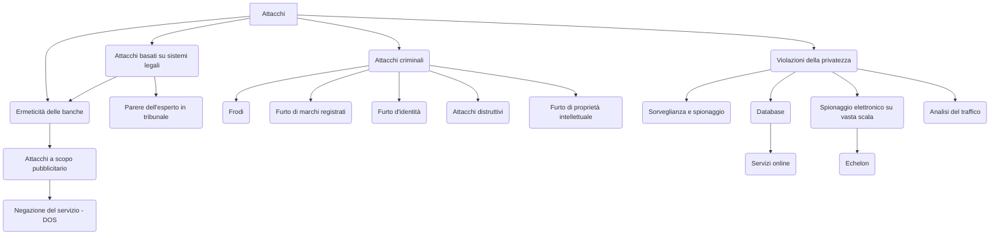
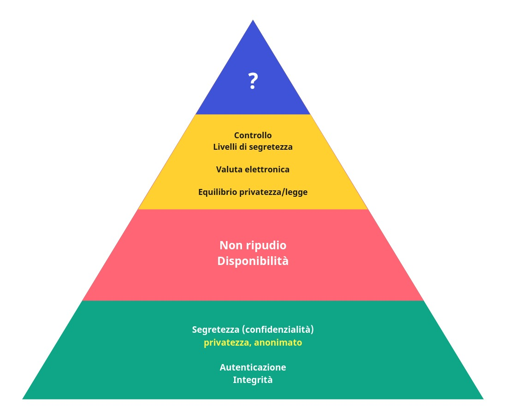

# Attacchi

## Classificazione degli attacchi

Gli attacchi sono **classificabili in base all'obiettivo**. Alcuni esempi sono:

- **accesso al sistema**
- **accesso per conto di un altro**
- **guadagno di privilegi**
- **impersonificazione**
- **furto di dati**
- **DOS**
- **mancato recapito**

Possiamo riassumere la definizione già vista di sicurezza come:
$$
sicurezza = prevenzione\ attacchi + corretto\ funzionamento\ del\ sistema
$$
Dove per **corretto funzionamento** indichiamo l'**insieme dei requisti funzionali e non funzionali**.

## Esempio di attacco reale: furto (o perdita) di dispositivi

- **attacco fondamentale: accesso al sistema**
  - **contromisure**: sistemi di autenticazione per accedere al sistema
- **attacco successivo 1: uso funzionalità di sistema**
  - **contromisure**: autenticazione per accedere alla funzionalità (sicurezza di livello superiore)
- **attacco successivo 2: acquisizione di dati sensibili**
  - **contromisure**: crittografia

Dobbiamo focalizzarci su relazioni causa-effetto, a più livelli, pensare sempre al **worst case scenario**.
Non dobbiamo illuderci che una sola misura di sicurezza sia abbastanza per mettere in sicurezza l'intero sistema e dobbiamo comprendere al meglio i limiti delle misure di sicurezza adottate (es: il sistema di recupero password può essere aggirato, le password salvate in un browser non protetto a sua volta da **master password**).

Come già visto, affidarsi ai tools, anche se ideati per fini di protezione e supporto, è un atto di fede e spesso non ci si domanda come questi funzionino internamente, rendendo le loro vulnerabilità invisibili.

I browser si sono evoluti per proteggere le password e l'utilizzo stesso del browser per evitare che venga raggirato per accedervi. Ovviamente non è uno standard e i browser si sono adattati con tempi diversi.

I browser rappresenta un buon esempio di come, per via dell'usabilità, spesso si viene a configurare una vulnerabilità: non effettuo l'autenticazione sui vari siti di volta in volta perché il browser immette le mie credenziali. Discorso analogo con la carta di credito che sotto un tot di spesa non richiede l'autenticazione.

## Esempio di attacco reale: rooting di linux post-furto

Su Ubuntu 12.04, premere SHIFT durante il boot e selezionare immagine di sistema.

:pencil: **Domanda d'esame**: come si attacca fisicamente una macchina?

## Esempio di attacco reale: pirateria digitale

- **Furto di proprietà intellettuale**
  - **contromisure**: watermark (contro: è debole perché reversibile)
- **Furto di indentità**
- **Furto di marchio**

## Esempio di attacco reale: sniffing

Scenario molto comune visto che spesso si è sotto la stessa rete.

## Tassonomia di attacchi

Da [Bruce Schneier](https://en.wikipedia.org/wiki/Bruce_Schneier):

# Proprietà di sicurezza

Vedi standard **ISO 27001** per la sicurezza dei sistemi informativi

Triade di sicurezza: **CIA**

- **Confidenzialità**
- **Integrità**
- **Disponsibilità (availability)**

Secondo il prof. G.B. la disponibilità è meno importante dell'autenticazione (come riportato dal diagramma a piramide).

L'attacco DOS è mirato al ripudio della proprietà di disponibilità.

## Segretezza vs autenticazione

Segretezza e autenticazione sono due concetti diversi. **La segretezza presuppone una policy**. Una cosa è segreta, la so solo io? È condivisibile? Secondo quali policy.

:notebook_with_decorative_cover: **Definizione** di segretezza: l'informazione può essere rilasciata a chi, secondo la policy definita, ha il diritto di conoscerla. Non ha senso quindi parlare di segretezza se non esprimo la policy che mi permette di discriminare.

Spesso i segreti sono condivisi. La mia password ad esempio non la conosco solo io ma la conosce anche il mio sistema.

## Cifratura vs steganografia

La cifratura non nasconde ma **trasforma i messaggi**. L'informazione cifrata è **"non deducibile"**. Con tecniche differenti, l'informazione diventa **"non distinguibile"** (esempio: qualsiasi sistema steganografico, come il sistema **chaffing&winnowing** e **least-significant bit** per il **covert channel**). Deduciamo quindi che la crittografia è una misura di sicurezza ma non l'unica.

------

**Elenco di lettura**

- [Covert channel](https://en.wikipedia.org/wiki/Covert_channel)
- [Pubblicazione del prof G.B. - Invalid certificates in modern browsers: A socio-technical analysis](https://www.iris.unict.it/handle/20.500.11769/366505)

