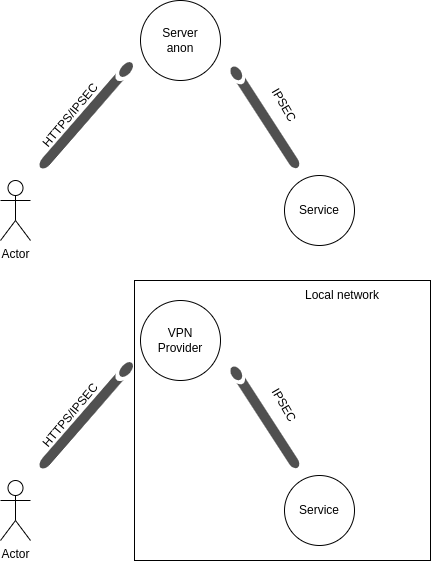

# Privacy

Una misura per la privacy è raccontare come verrà trattato il dato personale. Serve poi che l'individuo accetti la policy.Il termine "misura" è un termine di stampo ISO.

Alcune osservazioni:

- **Temporalità della privacy**: quanto tempo vengono tenuti i dati? Per quanto tempo sono "protetti"?
- Diritto in UE, non in USA: tradizionalmente negli USA il dato personale è stato spesso merce di scambio, in UE è stato più tutelato. Il trasferimento (export) del dato dall'UE agli USA rappresenta un problema.
- **Profilo**: descrizione astratta dell'individuo, in base a ciò con cui si interfaccia. La profilazione è un calcolo in base a degli indici, in base ad un algoritmo. 

# Anonimato

L'anonimato è un diritto, una **privatezza istanziata all'identità**. Può essere inteso come un sottoinsieme della privacy. Non sempre è inteso e rispettato come un diritto. **L'anonimato è utile per la protezione del dato (è quindi spesso un obiettivo di business).**

:pencil: **Domanda d'esame**: Che cos'è l'animato? Come diritto assoluto è discutibile? 
Esempio di risposta: è una misura apprezzabile lì dove registriamo dati personali. Lì dove venissero persi non sarebbero riconducibili ad un'identità (vedi articolo 32 o 33 paragrafo 1 GDPR). Esempio: dati medici registrati in tuple pseudo-nimizzate.

L'anonimato è un principio estremo, inapplicabile spesso non solo per motivi etici ma anche tecnici. Ci sono dei servizi che richiedono l'autenticazione e questo va proprio contro la definizione dell'anonimato.

Alcune misure di anonimato:

- **psuedo-anonimato** (si potrebbe de-anonimizzare e risalire al proprietario) vs. anonimato 
- **navigazione anonima** sui browser (anche qui abbiamo delle limitazioni: registrazione di IP, posizione, e info dello user agent da parte dell'ISP stesso e dei servizi. Il logging da parte dell'ISP è spesso obbligatorio. Il natting trasparente o opaco rappresenta un altro discriminante di anonimato )
- **anonimato a livello di routing**: TOR (rende il traceback del destinatario al chiamante più difficile, ma non impossibile. Per tracciare l'IP chiamante tutti i nodi devono partecipare. Vedi anche [ProxyChain](https://github.com/haad/proxychains) )
- **anonimato a livello applicativo**: web proxy server. Può essere utilizzato come **server anonimizzatore**. Espongo l'identità solo al servizio che mi offre le pagine. **Il server anonimizzatore è differente dalla VPN**.

## Differenza tra server anonimizzatore e VPN

Il servizio di VPN anonimizza anche rispetto all'ISP. Faccio tunneling attraverso il fornitore del servizio, spesso attraverso tunnel crittografici HTTPS/IPSEC. La VPN può essere utilizzata anche per accedere ad un servizio usando una posizione indebita.

**Differenza tra server anonimizzatore e VPN**: l'obiettivo. Il primo nasce con l'obiettivo di proteggere l'IP chiamante, può  infatti venire utilizzato con interessi malevoli. Il secondo **fornisce un IP locale** per accedere ad un servizio. Differiscono quindi per policy. Il servizio di anonimizzazione è una stiracchiatura del concetto di VPN. L'anonimato, nel caso della VPN, è limitato alla policy applicata dal provider del servizio VPN. Dobbiamo autenticarci con il provider del servizio infatti. Anche in questo caso c'è una certa dose di fiducia verso il fornitore del servizio.

# Non ripudio

Analizziamo le proprietà di livello due nello schema a piramide già introdotto.

Il **non ripudio** consiste nell'**impossibilità di negare la propria partecipazione ad una transazione con uno specifico ruolo**. La non ripudiabilità ha sempre a che fare con terze parti. Chi ci autentica certamente riceve evidenza della partecipazione alla transazione, questo non significa che possa fornire questa evidenza a terzi. La PEC ad esempio fornisce non ripudio.

L'autenticazione è necessaria per il non ripudio ma non è sufficiente. Qual'ora ci fosse il non ripudio, significa che c'è stata necessariamente autenticazione. L'anonimato implica infatti l'assenza di non-ripudio.

Per ulteriori approfondimenti vedere le slide del prof. G.B.

:pencil: **Domanda d'esame**: descrivere la relazione tra le proprietà su.
**Esempio di risposta:** descrivere come riportato poco su, aggiungendo scritte le proprietà e le loro implicazioni logiche
$$
1. \ autenticazione \rightarrow \neg anonimato \\
2. \ anonimato \rightarrow \neg autenticazione \\
3. \ non\ ripudio \rightarrow autenticazione \\
4. \ anonimato \rightarrow \neg non \ ripudio (2, contra(3))\\
5. \ non \ ripudio \rightarrow \neg anonimato \ (3,1)
$$
Ovviamente **è falsa l'implicazione**:
$$
autenticazione \rightarrow non \ ripudio
$$
È importante ricordare che queste relazioni valgono se si parla di garantire le proprietà contemporaneamente (nello stesso istante temporale), sono però ottenibili entrambe tramite enforcing temporaneo, ovvero se volute ed applicate in momenti differenti, come si vedrà per il protocollo WATA.

------

**Elenco di lettura**

- [I dati sensibili nel GDPR](https://www.privacylab.it/IT/205/I-dati-sensibili-nel-GDPR/)
- [Articolo 32 EU RGPD "Sicurezza del trattamento"](https://www.privacy-regulation.eu/it/32.htm)
- [Articolo 32 del GDPR: sicurezza del trattamento e misure tecnico-organizzative previste dalla normativa](https://dataprogdpr.com/articolo-32-gdpr-misure-sicurezza-trattamento/)
- [OpenVPN](https://openvpn.net/)