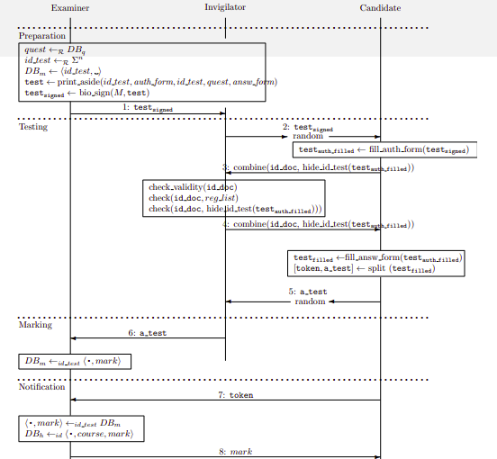

# Analisi del protocollo Written Authenticated Through Anonymous (WATA)

Uno scenario reale in cui gli attori in gioco vogliano ottenere sia l'autenticazione che l'anonimato è dato dagli esami scritti universitari. Il docente ha un certo interesse nell'autenticare lo studente e lo studente, al fine di tutelarsi dalla possibile non imparzialità del docente, ha abbastanza interesse a rimanere anonimo.

Queste due proprietà abbiamo visto essere in netto contrasto e, da una prima analisi, esclusive.

Analizziamo il protocollo [qui descritto](https://www.scitepress.org/papers/2010/27974/27974.pdf) per spiegare come queste proprietà possano coesiste all'interno dei sistemi reali.

**Written Authenticated Through Anonymous (WATA)** è un protocollo progettato e implementato in **nas.inf**.

**Obiettivi del protocollo**

- Autenticazione del compito per prevenire imbrogli dello studente (tutela del docente)
- Anonimato del compito per prevenire votazione iniqua (tutela dello studente)

Seguire le regole di un protocollo di sicurezza è fondamentale se si vuole godere delle proprietà offerte da quest'ultimo, ma non solo: fare in modo che anche gli altri attori in gioco rispettino la **cerimonia di sicurezza** garantisce le proprietà. Se gli altri non rispettano il protocollo anche noi veniamo compromessi. Le procedure d'esame non fanno eccezione. Per questo motivo è importante conoscere e verificare che gli altri siano diligenti nel seguire le direttive date.

Nel caso in cui il protocollo sia pienamente distribuito verificare che la controparte segua il protocollo è molto più difficile.

Come molti dei concetti visti, autenticazione ed anonimato non sono concetti assoluti ma vanno sempre visti in relazione al "di che cosa" o "da chi". Ad esempio, nello scenario dell'esame scritto vanno identificati sia lo studente che il compito (e la loro relazione deve essere chiara), ovvero l'autenticazione in questo contesto richiede che il compito sia legato (**autenticato**) rispetto alla persona.
C'è anche bisogno del controllo sulle procedure (sorveglianza), per fare in modo che tutto venga rispettato.

Ritroviamo qui il **principio di accatastamento delle difese**: utilizzare più misure di sicurezza per ottenere il risultato voluto. Il fallimento di una delle difese lascia spazio alla violazione della proprietà di sicurezza, anche se non necessariamente il fallimento di un obiettivo del protocollo porta inevitabilmente al fallimento degli altri, dipende infatti da quanto gli obiettivi sono legati.

Il problema dell'**invigilation** è complesso sia dal punto di vista del docente che dello studente. Il riconoscimento dello studente da parte del docente avviene inevitabilmente durante un esame, di fatto può esserci l'anonimato dei dati personali ma non del volto.

La semplice azione di rimescolare la pila dei compiti può essere vista come una misura di sicurezza, lì dove l'obiettivo sia l'anonimato. Una pila di compiti non ordinati non permetterebbe al docente di risalire allo studente.

:pencil: **Domanda d'esame**: perchè il compito di WATA ha un ID?
Risposta: perchè altrimenti non sarebbe de-anonimizzabile nella fare di autenticazione.

In **WATA v2** il token e il compito sono abbinabili per mezzo di un ID.

## Osservazioni sull'impiego di un oggetto fisico per l'autenticazione

- **Lo studente porta a casa il token, se lo studente perde il token, perde il compito.**
  **Solo lui risolvere tra compito e anagrafica.**
- Il token deve essere robusto all'attacco fisico.

## Alcune soluzioni per (provare ad) ottenere le due proprietà durante un esame

- il ruolo del docente e del vigilator non colludono
- nel momento dell'autenticazione lo studente copre dal codice a barre a scendere,così il docente può memorizzare solo nome, cognome e matricola
- consegna dei compiti randomizzata all'inizio dell'esame
- il docente appone al firma sul token: a cavallo tra bar code e token, così da avere più tutela
- il token deve essere pre-firmato così che il docente possa controllare che l'anagrafica dello studente corrisponda
- l'anonimato è abbinato al compito quando il compito è in fase di marking (valutazione).
  **Il compito non è anonimo sempre ma solo in questa finestra temporale**.

Alcune delle soluzioni qui descritte sono presenti nel protocollo **WATA**.

:pencil: **Domanda d'esame**: descrivere il protocollo WATA.

## Fasi del protocollo

L'esame viene definito da **4 fasi**:

- **setup**
- **testing**
- **marking**
- **notifica di voto**

Nel caso di WATA2 le misure sono così stringenti che la figura di docente e vigilator possono coincidere (prima delle soluzioni proposte al punto precedente).

:pencil: **Domanda d'esame**: quanti sono i controlli del protocollo WATA che fa l'esaminatore?
**Esempio di risposta**: 4. I tre visti nelle slide ed in aggiunta la verifica del volto.

:pencil: **Domanda d'esame**: dov'è l'autenticazione del candidato nel protocollo **WATA2**? Dov'è invece l'anonimato del compito?
**Esempio di risposta**: l'autenticazione avviene in fase 2, durante al fase di testing. L'anonimato lo si ottiene in fase di marking

## Spiegazione dettagliata

In fase di preparazione (preparation) l'esaminatore ha il compito di:

1. generare le domande del compito, in questo caso attingendo ad un database di domande
2. generare un ID univoco per il test
3. memorizzare l'ID del test sul database contenente le associazioni test - voto (la sezione voto sarà nulla)
4. stampare sul test le due sezioni, quella con il form di a e quella con il solo token, più la parte relativa alle domande e alle risposte
5. pre-firmare o comunque apporre un timbro a cavallo tra il token e il resto del test.

 Si conclude, dopo questi  5 step, la preparazione e si passa alla fase di testing.

In fase di testing gli attori in gioco sono due: invigilator e candidato che si sottopone all'esame. L'invigilator distribuisce i test (prefirmati) in maniera randomica. La fase di testing si compone quindi di:

1. L'invigilator distribuisce i test in maniera randomica
2. Il candidato compila il form di anagrafica con le proprie informazioni
3. L'invigilator controlla il documento identificativo fornito dal candidato, verifica inoltre che:
   1. Il documento sia valido ed effettivamente associato al candidato
   2. Il candidato sia nella lista dei prenotati
   3. I dati riportati sul documento e quelli riportati sul test coincidano
4. Durante il punto 3 il candidato ha cura di nascondere l'ID del test per mitigare eventuali collusioni tra invigilator ed esaminatore (nascondendo l'ID per certo non si potrà associare lo studente al compito)
5. L'invigilator ritorna il documento al candidato
6. Il candidato svolge il test
7. Il candidato divide il test dal token. Ora il test è anonimo.
8. A conclusione dell'esame ogni candidato inserisce il proprio test in un punto randomico della pila di compiti

Il candidato porterà con sè il token, lasciando il test anonimo.

Si conclude qui la fase di test e si entra il quella di marking. L'invigilator fornisce i compiti (anonimi) all'esaminatore che li valuta.

1. L'esaminatore corregge il compito (anonimo)
2. L'esaminatore inserisce, per il dato ID del compito (sono presenti due ID, uno sul token e uno sul lato opposto al token) la valutazione

Si conclude la fase di marking e si passa a quella di notifica. I candidati vengono notificati della correzione.

1. Il candidato risolve l'associazione utilizzando il proprio token
2. Risolta l'associazione il voto viene ufficialmente registrato

Il protocollo si conclude con quest'ultimo step.

### Considerazioni finali

- Il protocollo non è resiliente alla collusione tra candidato ed esaminatore (di fatto, si potrebbe argomentare che non è stato progettato per questo modello di attaccante). Al candidato che voglia colludere con l'esaminatore basterebbe concordare un segno distintivo da apporre sul compito. La figura di un invigilator non colluso può mitigare il tutto ove questo si accorgesse del tratto distintivo e riportasse la cosa.
- Se WATA è utilizzato come strumento non istituzionale nelle ultime due fasi del protocollo potrebbe configurarsi un attacco. Dovendo registrare il voto in un sistema terzo, quello ufficiale utilizzato dall'ateneo ad esempio, l'esaminatore può, vedendo risolta l'associazione candidato / test, inserire un voto differente rispetto a quello riportato sul compito di WATA.
- La proprietà di randomizzazione dei compiti fornisce una difesa in più nel caso in cui invigilator ed esaminatore colludano. L'invigilator non può contrassegnare un certo compito sulla base della posizione nel fascio di compiti ad esempio, può però memorizzare tratti distintivi del compito, come ad esempio la grafia del candidato, quindi potrebbe comunque riuscire ad identificarlo e segnalarlo all'esaminatore.