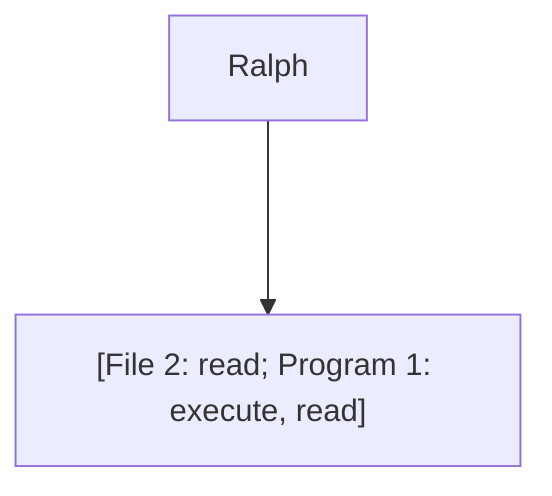

# Access Control Matrix

:notebook_with_decorative_cover: **Definizione di meccanismi implementativi**: come applicare le policy in modo da garantire il controllo di accesso.

L'**Access Control Matrix** (matrice per il controllo di accesso) è un meccanismo implementativo di questo tipo.

Per costruire una **ACM** implementiamo una griglia dove scriviamo **soggetti ed oggetti**, ovvero chi può fare cosa. **Ciascuna cella della griglia dice i permessi di un soggetto su un dato oggetto**. Questo meccanismo implementativo è indipendente dalla policy.

Esempio di matrice per il controllo d'accesso:

| P     |       | F                  |       |       |
| ----- | ----- | ------------------ | ----- | ----- |
| [...] | [...] | [...]              | [...] | [...] |
| pippo | [...] | :white_check_mark: | :x:   | [...] |
| [...] | [...] | [...]              | [...] | [...] |

Può essere più comodo registrare queste matrice **per righe o per colonne**.
Otteniamo così le seguenti implementazioni:

- **Access Control List**:

```
File 2: [Alice: read, write; Charlie: read]
```

- **Capability List**:
  - ogni riga dell'ACM registrata con uno specifico oggetto



# Tassonomia di attaccanti

[Bruce Schneier](https://en.wikipedia.org/wiki/Bruce_Schneier), già menzionato nella lezione [5](./L05_Attacchi_ProprietaSicurezza.md), cataloga anche gli attaccanti.

Caratterizziamo gli attaccanti per:

- **risorse**
- **esperienza**
- **rischio accettato**

:pencil: **Domanda d'esame**: esemplificare i criteri per classificare gli attaccanti.
**Esempio di risposta**: le 3 proprietà su.

**Moventi degli attaccanti**:

- ricchezza (benessere materiale)
- informazioni (personali, sensibili)
- potere
- gloria
- divertimento

**Nomi e ruoli degli attaccanti**:

1. Hacker (cracker)
2. Attaccanti interni
3. Spionaggio industriale
4. Servizi segreti
5. Organizzazioni criminali/terroristiche
6. Difesa

Eventuali altre informazioni sulle tassonomie inerenti l'argomento possono essere trovati nei libri di Schneier.

# Modelli di attaccante

Come facciamo a fare delle affermazioni in termini di sicurezza in maniera universale? Una sorta misura assoluta, di "complessità ciclomatica" per sicurezza? Introduciamo il concetto di **modello di attaccante** per verificare le proprietà di sicurezza dei sistemi.

I modelli di attaccante, delle **astrazioni che ci permettono di guardare il problema dall'altro e imporre delle regole universali**. Fissato un modello di attaccante, possiamo fare delle valutazioni. Il protocollo di sicurezza è quindi sicuro **in relazione ad un certo modello di attaccante**.

Qual è però il giusto modello di attaccante da prendere in esame? Come identifichiamo lo scenario peggiore? Non abbiamo spesso la lista di tutti i possibili attaccanti. Come facciamo a definire tutti i possibili scenari? **Il problema è aperto e non riusciamo a definire tutte le possibilità offensive**.

## Modello Dolev-Yao (DY)

Il modello di attaccante che, nei modelli distribuiti, nello standard di fatto, è considera il peggiore, è quello **Dolev-Yao (DY)**

:notebook_with_decorative_cover: **Definizione**: l'attaccante è unico e superpotente, ovvero controlla l'intera rete, ma non può violare la crittografia.

**Si dimostra che un insieme di attaccanti collusi (fanno squadra, si mettono insieme) equivale a DY**.
Lo scenario su cui si basa questo modello prevede che l'interesse degli attaccanti sia comune, al punto tale che li porti alla collusione.

Questo modello è stato introdotto nel **1983**.

## Modello di attaccante General Attacker (GA)

Il modello di collusione di DY non risulta più appropriato dal momento in cui le capacità computazionali diventano disponibili su larga scala e a tutti e gli interessi nel violare un sistema diventano eterogenei.

:notebook_with_decorative_cover: **Definizione**: chiunque può essere attaccante senza interesse a colludere con gli altri, al peggio con capacità di totale controllo della rete, ma senza violare la crittografica.

GA può essere considerato come l'inverso logico di DY, ovvero l'attaccante non ha più bisogno di colludere con altri.

**Si configura uno scenario dove gli attaccanti non colludono in quanto non hanno interesse comune ma ognuno ne ha uno differente e potrebbe addirittura voler primeggiare sugli altri.**

Questo modello nasce nel **2003** ed è più aderente al panorama tecnologico attuale.

Un sistema può essere sicuro rispetto ad un certo modello, DY ad esempio, ma non esserlo rispetto ad un altro, ad esempio GA. Oppure può essere insicuro rispetto ad uno e **maggiormente insicuro** rispetto ad un altro.

Ad oggi spesso si definisce ad hoc il modello di attaccante, in base al proprio sistema. Tipicamente il modello è un derivato di uno dei due visti.

### Considerazioni e catalogazione di WATA in base ai modelli GA e DY

Il modello di attaccante di WATA è una variante a metà tra General Attacker e Dolev-Yao.
Le capacità offensive (ovvero di deviare dal protocollo) le hanno tutti i partecipanti, quindi potremmo dire che **General Attacker sia più affine**.

Se in WATA non ci fosse la randomizzazione otterremo un modello di General Attacker puro.
Se assumo che invigilator ed esaminatore siano entità che non possano colludere, allora la proprietà di anonimato dello studente sussiste anche senza la proprietà di randomizzazione dei compiti.
Se assumo invece che i due possano colludere invece la proprietà di anonimato dello studente ha un attacco.

Notare bene che la collusione di invigilator ed esaminatore non rende WATA più affine a Dolev-Yao in quanto gli studenti sono molteplici e non colludono (se non in maniera opzionale per il proprio tornaconto).

C'è poi un certo interesse a non violare totalmente le regole in quanto si potrebbero perdere i benefici del protocollo di sicurezza.

### Considerazioni generali

- **A prescindere dal modello però, l'approccio più adatto (e moderno) sarebbe definire al meglio le capacità offensive dei partecipanti**. Difatti, ad oggi, non ci si domanda più a quale modello si afferisca.
- In entrambi i modelli visti si assume inoltre che gli attaccanti non possano violare la crittografia per porre il focus sul sistema in generale, ovvero scegliamo deliberatamente di non porre l'attenzione sul cripto sistema (diamo "per scontato" che le misure crittografiche siano abbastanza buone, ovvero che il cripto sistema sia sicuro).
- Dolev-Yao è abbastanza complesso da realizzare su larga scala, un po' più semplice su LAN. Attacchi reali su larga scala non sono quindi realistici visto che DY è incredibilmente potente, il che è irrealistico in questo scenario.

# Scenari di autenticazione

Abbiamo varie ambientazioni nel caso dei sistemi di autenticazione:

- **utente-computer**: la più comune per accedere ad un sistema (password, impronte)
- **computer-computer**: da una macchina ad un altra, indipendentemente dal suo utente (IP, MAC)
- **computer-utente**: per una macchina remota (sito internet).
  Scenario tipico quando un utente riconosce il sito alla quale vuole accedere come legittimo
- **utente-utente**: rara (ad esempio Kerberos)

Abbiamo visto e parlato abbondatemene del primo e del terzo scenario.

## Autenticazione utente-computer

Rivediamo concetti già accennati nelle precedenti lezioni. Questo tipo di autenticazione può essere:

- **basata su conoscenza**: di segreti prestabili e precondivisi (password, passphrase, PIN)
- **basata su possesso**: di dispositivi magnetici ed elettronici (card magnetiche, smart card, smart token)
- **basata su biometria**: caratteristiche fisiche dell'utente (impronte, iride, tono di voce).
  Uno dei limiti della biometria è che le caratteristiche sono poche e facili da "lasciare in giro". Una volta ottenuta, si può accedere a tutti i sistemi che utilizzano quella caratteristica. 
  Ha il pro di essere molto usabile ma è, per i motivi visti, abbastanza insicura.

Spesso vengono utilizzate in combinazione.

### Autenticazione basata su conoscenza

Corre rischi di:

- **guessing**: indovinata (attacco standard, attacco dizionario, attacco brute force)
- **snooping**: sbirciata mentre viene inserita
- **spoofing**: scoperta tramite falsa interfaccia di login
- **sniffing**: intercettata

#### Attacchi e contromisure

Tipi di attacchi:

1. Attacco standard: password brevi, tipiche, relative all'utente
2. Attacco dizionario
3. Attacco brute force

Contromisure:

1. Controllo sulla password: password non banale

2. Controllo sul numero di inserimenti: limitare il numero di tentativi, pena il blocco

3. Uso di CAPTCHA:

   - Completely Autemated Public Turing Test To Tell Computers and Humans Apart

   - Il sistema richiede la risoluzione di un CAPTCHA per verificare il tentativo di login

   - Ad oggi è comunque violabile con un algoritmo basato su Google Street View.
     Un alternativa è **reCAPCHA**, che attraverso il tracciamento sa già chi è l'utente.

:pencil: **Domanda d'esame**: cos'è un CAPTCHA? Cos'è un test di Turing? Quali sono i limiti delle CAPTCHA? Hanno già esaurito il loro tempo? Che cos'è reCAPCHA?

------

**Elenco di lettura**

- [When did the 'tick' and 'cross' symbols become recognised as the notation for 'correct' and 'incorrect'? Where do these symbols originate from?](https://www.theguardian.com/notesandqueries/query/0,5753,-60164,00.html)
- [Agenzia per la Cybersicurezza Nazionale](https://www.acn.gov.it/)