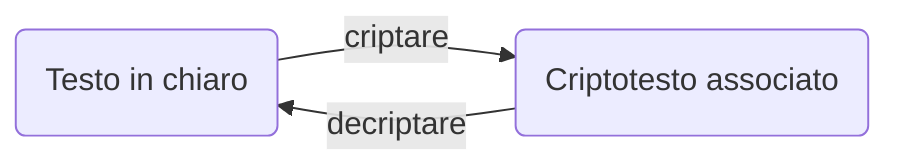
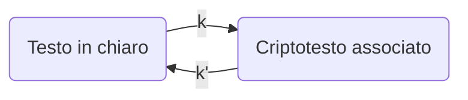
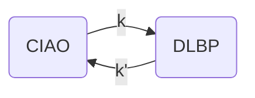
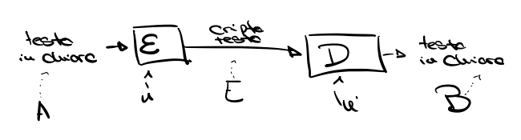

# Mantenere le password

:pencil: **Domanda d'esame**: qual è un modo per mantenere una password?
Esempio di risposta: memorizzarla su un database.

Negli anni 60 nasceva l'idea (l'esigenza) di mantenere le password su database.
Siamo nel periodo del **Compatible Time Sharing System** del MIT, un sistema multi-utente.
Inizialmente le password erano memorizzate in chiaro e c'erano solo delle policy a gestire l'accesso. 

Non si parla ancora di autenticazione e login e le password sono in chiaro perché lo scopo del sistema non era ancora quello di essere "sicuro".

# Autenticazione basata su possesso

Anche detta autenticazione "al portatore". Fatta attraverso un certo oggetto, tipicamente magnetico o elettronico (smartcard, carta magnetica, smart token).

**Limiti**: un oggetto può essere perso o ceduto.
**Irrobustimento**: autenticazione a due fattori.

## Smart token

Lo smart token è stato nel tempo sostituto dall'autenticazione con OTP (one-time password) attraverso le app.
Lo smart token forniva OTP, a volte richiedeva una password per farlo (era quindi fornito di tastiera / tastierino numerico).

:pencil: **Domanda d'esame**: cosa bisogna fare affinché uno smart token fornisca OTP?
Esempio di risposta: a seconda dello smart token è possibile che bisogni fornire un PIN o una password. Alcuni smart token lo generano senza richiedere autenticazione immediatamente prima, va spesso inserita dal sito.

L'utilizzo di una password OTP nasce dall'esigenza del sistema di accedere allo smart token, in modo da autenticarlo. Impersonare il possesso è abbastanza difficile, proprio per la frequenza di cambio del codice. Abbiamo quindi due misure di sicurezza: il segreto è mutevole e tipicamente è protetto durante la trasmissione (ad esempio è inserito su un sito che è protetto da HTTPS).

Tipicamente lo smart token è basato su una blanda sincronizzazione dell'algoritmo, un'istanza sul server e una sullo smart token. **Spesso gli algoritmi sono basati su generazione pseudo-randomica, basata su un seed comune** (vedi **PRF**).

Passare dagli smart token (che rappresentano un sistema chiuso), alle app su smartphone (sistema aperto), porta con se sì la presenza di più misure di sicurezza accatastate tra loro ma anche la possibilità di accedere a più vulnerabilità.

:pencil: **Domanda d'esame**: che differenza c'è tra l'autenticazione ad un vecchio sito web e quella al bancomat?
Esempio di risposta: il bancomat è protetto da un sistema di possesso (smart token o app) + conoscenza di un segreto. Ad oggi molti siti ovviamente hanno un sistema di autenticazione molto simile a quello implementato per i bancomat.

:pencil: **Domanda d'esame**: qual è la differenza tra smart token con tastiera e quello con semplice pulsante? Le due misure sono equivalenti o una è più robusta dell'altra?
Esempio di risposta: le due misure sono equivalenti (se per lo smart token con pulsante va poi inserito un qualche PIN / password sul sito, il segreto è quindi distribuito). La bontà di una o dell'altra misura dipende dallo scenario di utilizzo ed entrambe hanno punti a favore e a sfavore.

**La OTP è una misura di sicurezza più forte del PIN**.

Gli smart token sono facilmente clonabili, a differenza delle smart card che "proteggono i propri segreti".
Ad oggi il concetto di possesso e di conoscenza sono molto simili e spesso si mescolano.

# Autenticazione basata su biometria

Possesso di caratteristiche biometriche, univoche, a prova della propria identità.

Tipi di caratteristiche biometriche:

- fisiche: impronte, forma della mano, retina e viso
- comportamentali: firma, timbro di voce, grafia, andatura, keystroke dynamics.

Tecnicamente meno accurata dei metodi già visti ma comunque più affidabile:

- lettere e numeri di una password hanno una rappresentazione digitale esatta e conosciuta, univoca, mentre non è così per i campioni biometrici, che non sono mai totalmente accurati nella loro rappresentazione digitale. Un'impronta può essere sporca, il sensore può essere più o meno preciso etc etc...

## Funzionamento dell'autenticazione biometrica

Fase iniziale di campionamento:

- si eseguono più misurazioni
- si definisce un **template** che media le misurazioni e rappresenta la caratteristica (misura mediata e non esatta quindi)

Fase di autenticazione:

- confrontiamo la caratteristica appena misurata e il template
- se avviene corrispondenza otteniamo un successo. Spesso una soglia di errore tollerata (appunto perché non è una misura esatta).

:pencil: **Domanda d'esame**: problema dell'accuratezza del campione biometrico, quando ce l'abbiamo?
Esempio di risposta: sia in fase di campionamento del template che in fase di comparazione tra il campione corrente e il template.

Non possiamo quindi dire che: 
$$
Stored\ Biometric\ Pattern \equiv  Template
$$
Visto che ci sono delle soglie di tolleranza da considerare.

### Classificazione delle impronte

Tre schemi per la scansione: 

- **Loop**
- **Arch**
- **Whorl**

**Minuzia: i punti salienti dell'impronta digitale**
Gli algoritmi per il riconoscimento dell'impronta spesso memorizzano le coordinate delle minuzie.

:pencil:**Domanda d'esame**: cosa sono le minuzie?

# Cenni di crittografia

A grandi linee la crittografia può essere intesa come una traduzione in un'altra lingua, una trasformazione verso qualcosa di non comprensibile. Tradurre in un'altra lingua significa infatti cambiare la sintassi mantenendo la semantica, cosa che avviene anche con gli algoritmi di crittografia deterministici.

Ciò che contraddistingue la crittografia rispetto alla traduzione è l'utilizzo di **chiavi** per "tradurre" (appunto cifrare) i messaggi.

A seconda del sistema in uso, le chiavi possono o meno corrispondere:
$$
k = k' \Leftrightarrow sistema \ simettrico
$$

$$
k ≠ k' \Leftrightarrow sistema\ asimmetrico
$$

Uno degli aspetti più importanti (a meno che non si parli di chiavi pubbliche), è la **segretezza della chiave**.

## Definizione di crittosistema

Definiamo così un crittosistema:
$$
k,k' \ chiavi, \ m \ messaggio , \Epsilon, \ D \ funzioni\ di \ cifratura \ e \ decigratura: \\\\
\Epsilon(k,m) \rightarrow m_k \ (ottengo \ il \ crittotesto \ m_k) \\
D(k',m_k) \rightarrow m \ (ottengo \ il \ testo \ in \ chiaro \ m)
$$
Dove nello specifico:
$$
D(k',m_k) =
\begin{cases}
  m \ se \ k = k' \ \and \ <\Epsilon,D> \ simmetrico \\
  m' \ altrimenti
\end{cases}
$$
:pencil: **Domanda d'esame**: cos'è un crittosistema?

Alcune assunzioni fondamentali:

| Ciò che è pubblico |  Ciò che è privato   |
| :----------------: | :------------------: |
|  Il crittosistema  | Le chiavi utilizzati |

La cifratura può essere una misura di sicurezza nel momento in cui, intercettato un messaggio in maniera indebita, questo non è "traducibile"-

------

**Elenco di lettura**

- [Silvio Micali](https://it.wikipedia.org/wiki/Silvio_Micali)
- [Pseudorandom function family](https://en.wikipedia.org/wiki/Pseudorandom_function_family)