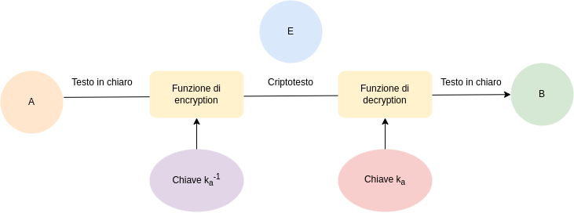
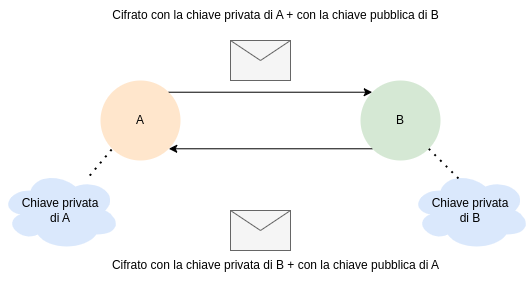

# Segretezza di una chiave

L'attaccante ha sempre una **probabilità non nulla** (e talvolta non trascurabile) di scoprire la chiave segreta.
La probabilità diminuisce man mano che la lunghezza della chiave aumenta.

$$
Data \ k \ chiave, vale\ sempre: \\
Pr[guess(k)] = \frac{1}{2^{|k|}}
$$
Elementi che irrobustiscono la chiave:

- non avere una dimensione fissa (se l'attaccante non conosce la lunghezza, deve fare molte più prove)
- avere chiavi molto lunghe

Un crittosistema è sicuro quando la probabilità di indovinare è inferiore a questa equazione.

# Crittografia simmetrica

:notebook_with_decorative_cover: **Definizione**: L'unico modo per estrarre il testo in chiaro da un crittotesto è decodificare quest'ultimo con la stessa chiave usata per costruirlo.
$$
D(\Epsilon(m,k)) = m \ (enunciato\ di \ correttezza) \\
\forall k', k' ≠  k \rightarrow D(\Epsilon(m,k), k') ≠ m (enunciato \ di \ robustezza) \\
$$
Questo crittostistema è anche detto "**a chiave condivisa**".

Fissato un **agente** $A$ (una coppia $<macchina, utente>$), esso sia munito di chiave simmetrica, indicata con $k_a$. 
Suddetta chiave $k_a$ è detta "**chiave a lungo termine**" perché il suo intervallo di validità è molto lunga.

Da questa affermazione deduciamo quindi che nessuna chiave sia segreta per sempre.
Chiamiamo invece le chiavi a **breve termine** "**chiavi di sessione**", con un tempo di vita molto più breve.

**Tipicamente grazie alla chiave a lungo termine otteniamo delle chiavi di sessione**.

Se l'attaccante riesce ad esfiltrare la chiave di sessione può avere accesso ai dati che due agenti si scambiano.

Ci sono dei problemi di funzionali oltre che di sicurezza, visto che il legittimo agente, diciamo $B$, con cui vogliamo comunicare deve ricevere la chiave.

## Limiti della crittografia simmetrica

1. $A$ non vuole rivelare $k_a$ a $B$, quindi questo non può decriptare
   - Sia $k_{ab}$ una chiave dedicata specificatamente a questa sessione fra $A$ e $B$
   - $k_{ab}$ è detta chiave a breve termine o chiave di sessione
   - Può essere condivisa tra i due agenti
2. Servirebbe una chiave di sessione per ogni coppia di agenti che vogliono comunicare
3. Come condividere $k_{ab}$ fra $A$ e $B$ pur mantenendola confidenziale?

Lo scambio del primo segreto è quindi il punto problematico.

# Crittografia asimmetrica

:notebook_with_decorative_cover: **Definizione**:

- Ogni chiave $k$ ha una sua **inversa** denotata $k^{-1}$
- Ciascuna chiave non si può ricavare dall'altra, pertanto **la coppia va generata monoliticamente**
- L'unico modo per estrarre il testo in chiaro da un crittotesto è decodificare quest'ultimo con l'inversa dalla chiave usata per costruirlo

$$
D(\Epsilon(m,k),k^{-1}) = m \ (enunciato \ di \ correttezza) \\
\forall k',k' ≠ k^{-1} \rightarrow D(\Epsilon(m,k),k') ≠ m \  (enunciato\ di \ robustezza)
$$

Chiamiamo $k$ e $k'$ le chiavi pubblica e privata.

Fissato un agente $A$ esso sia munito di una coppia di chiavi asimmetriche, indicata come $<k_a, k_a^{-1}>$ **a lungo termine**.

- $k_a$ resa nota a tutti, detta anche **chiave pubblica** di $A$
- $k_a^{-1}$ segreto di A, detta anche **chiave privata** di $A$

L'intruder $E$ in questo caso **non può rompere la proprietà di autenticazione** (non può impersonare $A$), sebbene possa decriptrarlo. Quindi l'autenticazione avviene in maniera sicura.

Rimosso il problema della condivisione del segreto iniziale ma perdiamo la segretezza. Come risolvere?

Utilizziamo una coppia di chiavi asimmetriche per ogni legittimo agente come segue.

Ho tre alternative per cifrare un messaggio che parte dall'agente $A$:

- con la chiave $k_a{-1}$ (**ottengo autenticazione di $A$ con $B$, ma non confidenzialità**)
- con la chiave $k_b$ (**ottengo confidenzialità di $A$ con $B$, ma non autenticazione**)
- con la chiave $k_a$ (questa misura è inutile perché solo A potrebbe decifrare)

Sommo (annido) le prime due misure per ottenere le entrambe le proprietà.

Astraendo dalle proprietà del criptosistema l'ordine di annidamento è irrilevante, se scendiamo nelle specifiche può avere importanza.

Indichiamo un messaggio cifrato con questo metodo come $ \{ m_{kb} \}_{{k_a}^{-1}}$

È importante notare come, per decifrare un messaggio, serva la chiave inversa **della controparte**. Un messaggio cifrato da un'eventuale attaccante, decifrato con la chiave legittima dell'agente A difatti non produrrà un messaggio in chiaro valido. 

L'associazione $chiave \rightarrow agente$ è quindi importante e da proteggere, perchè se si riuscisse a convincere l'agente che riceve ad utilizzare una chiave differente (quella dell'attaccante in questo caso) la misura di autenticazione andrebbe a crollare perchè si andrebbe ad autenticare erroneamente l'attaccante, credendolo l'agente legittimo.

Dobbiamo quindi **certificare che la chiave appartenga all'agente legittimo**.

## Limiti della crittografia asimmetrica

- **Certificazione**: come associare correttamente una chiave pubblica al suo legittimo proprietario, ovvero al legittimo proprietario della metà privata.
- Cosa succede se l'associazione non funziona?

| Limiti crittografia simmetrica | Limiti crittografia asimmetrica  |
| ------------------------------ | -------------------------------- |
| Scambio del primo segreto      | Certificazione dell'associazione |

# Crittosistema sicuro

:notebook_with_decorative_cover: **Definizione**:

- Sia calcolato $\Epsilon(m,k)$ per ogni testo $m$ e chiave $k$
- Sia calcolato:

$$
D(\Epsilon(m,k),k') = n \\ \\
\begin{cases}
\forall k'≠k \ se \ il \ crittosistema \ è \ simmetrico \\ 
\forall k'≠k^{-1}\ se \ il \ crittostistema \ è \ asimmetrico \\
\end{cases}
$$

- **Allora l’accesso a $n$ non aumenti significativamente la probabilità di un attaccante di indovinare $m$ o sue porzioni**

## Hash crittografico

Un buon hash crittografico necessita di requisiti, facili da definire in teoria ma difficili da garantire nella pratica. Nella pratica un buon hash **non è invertibile in maniera efficiente**.

**Elenco di lettura**

- [Diffie-Hellman](https://it.wikipedia.org/wiki/Scambio_di_chiavi_Diffie-Hellman)

