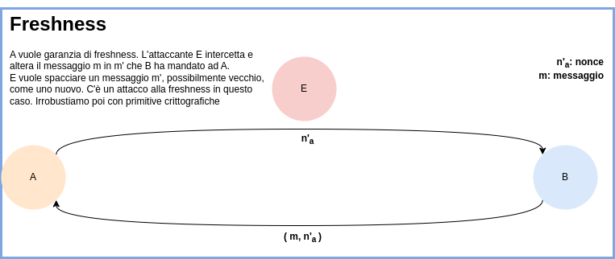

# Sicurezza delle password

Esempio storico di utilizzo dell'hash: CTSS + hashing, era un sistema del MIT per conservare le password hashate.

:pencil: **Domanda d'esame**: qual è il senso di avere delle funzioni hash qui?

Seppur in teoria l'hash non sia invertibile in pratica ha dei limiti ed è aggirabile tramite attacchi di forza bruta e/o con tabelle rainbow.
In questo sistema il confronto non avviene con la password in chiaro ma con il suo hash.

## Salting

Le password vengono "salate". Il sale (salt) è un messaggio random aggiungo alla password per proteggerla da attacchi a dizionario. Ciò viene fatto prima di applicare l'hash. Il sale rinforza così la password.

Storicamente Unix utilizzava 12 bit, oggi insufficienti.

Seguiva questi 3 step:

1. generava sale per ciascuna nuova password da memorizzare
2. usa la password per codificare una stringa di zeri insieme al sale 
3. mediante password encryption function **crypt(3) basata su DES**

Questi dettagli tecnici implementativi ovviamente non sono universali e dipendono dal sistema operativo.
Il punto **2** in particolare, pur non essendo direttamente un funzione hash, la simulava abbastanza bene.

**Utilizzare la password stessa, salata, per cifrarla**, è un modo intelligente per proteggere la password. Dovendo utilizzare una chiave diversa dalla password ci sarebbe stato il problema della sicurezza della chiave e del dover richiedere la chiave di volta in volta all'utente che voglia autenticarsi. 

Si dice che il sale "aggiunge entropia". Inizialmente si utilizzavano 3 bit, ad oggi i sistemi operativi utilizzano sale molto più lungo.

:pencil: **Domanda d'esame**: che differenza c'è tra hashing ed encryption?

Alla creazione dell'utente si genera il sale e lo user ID.
La chiave di 56 bit, ricavata dai 7 bit meno significativi dei primi 8 caratteri della password.

## Freshness

:notebook_with_decorative_cover: **Definizione**: importante **attributo** di almeno due proprietà di sicurezza fondamentali - **segretezza e autenticazione** - il quale stabilisce che esse valgano di recente.

La freshness ha quindi a che vedere **con la temporalità**.

Legami con le due proprietà:

- cambio periodico dei segreti per renderli robusti (segretezza)
- l'autenticazione va fatta sul momento (autenticazione)

La freshness permette di evitare **replay attack**.

Alcune misure:

- **timestamp**
- **nonce**: un numero randomico, utilizzato una volta sola

### Nonce

**Primo scenario**: la nonce viene mandata da $$A$$ a $$B$$, $$B$$ risponde con la nonce e il suo messaggio, il tutto in chiaro.
**Possiamo avere un attacco alla freshness** in questo caso. Irrobustiamo con una misura crittografica.
$$ {IMPLEMENTAZIONE 1 DEL PROTOCOLLO PER LA NONCE}
1. \ A \rightarrow B: N_a \\
2. \  B \rightarrow A : m_B, N_a
$$
**Secondo scenario**: proteggiamo la nonce con la crittografia (asimmetrica in questo caso), così da ottenere segretezza.
In questo scenario $$B$$ può rispondere in qualunque momento posteriore alla creazione della nonce. Ho la certezza che l'interlocutore sia legittimo (autenticazione). La presenza del messaggio da parte di $$B$$ è irrilevante ai fini dell'autenticazione con freshness, l'attenzione è posta sulla nonce.
$$
1. \ A \rightarrow B: {N_a}_{K_b} (cifro \  la \ nonce)\\
2. \  B \rightarrow A : m_B, N_a
$$
Notare bene che la nonce è cifrata solo al primo invio ( da $$A$$ verso $$B$$ ) e non alla risposta. 

Il trasporto della nonce in risposta però può compromettere la freshness, arriviamo quindi allo scenario tre.

**Terzo scenario**: Cifriamo il messaggio di risposta
$$
1. \ A \rightarrow B: n_a \\
2. \ B \rightarrow A: {(m_B,n_a)}_{K^{-1}_a}
$$
Il protocollo 1 e 3 sono equivalenti. Permettono di ottenere **autenticazione con freshness** di $$A$$ con $$B$$. La combo vincente è quindi **nonce + autenticazione**. Se vogliamo trasportare messaggi abbiamo problemi e solo con il protocollo 3 abbiamo una garanzia. 

Quando la nonce è un challenge per la freshness non è necessario che sia quindi confidenziale e può essere spedita in chiaro.

Ricapitolando quindi:

- timestamp
  - viene inserita da chi la garanzia intenda darla
- nonce
  - viene inserita da chi vuole prendersi la garanzia di freshness

:pencil: **Domanda d'esame**: differenza tra timestamp e nonce.

# Sintassi dei messaggi cifrati

Tipi di messaggi:

- **Atomici**
- **Concatenati**

Per i messaggi atomici:

- Nomi degli agenti: A, B, C ...
- Chiavi crittografiche: $k_a$, $k_b$, ${k_a}^{-1}$, ${k_b}^{-1}$, $k_{ab}$ (dove $k_{ab}$ è o una chiave di sessione o una chiave pubblica di crittografia asimmetrica)
- Nonce: $N_a$, $N_b$
- Timestamp: $T_a$, $T_b$
- Digest: $h(m)$, $h(n)$
- Etichette: "Trasferisci x da ..."

Per messaggi composti:

- Concatenazioni: $m, m'$, dove ciascuno può essere un crittotesto
- Crittotesti: $m_k$, il testo in chiaro può essere la concatenazione di più messaggi

:pencil: **Domanda d'esame**: si può autenticare un messaggio concatenato?
**Esempio di risposta**: Due crittotesti differenti concatenati possono essere singolarmente genuini ma non insieme (concateno due messaggi legittimi, magari provenienti da mittenti differenti). La concatenazione non è un operazione crittografica ma qualcosa che chiunque può fare (non serve autorevolezza per farla). Quindi non si può autenticare una catena di messaggi, alla meglio si possono autenticare le sue componenti singolarmente.

È importante notare come in contesti reali la visione degli agenti sia parziale e limitata alla propria area. È quindi importante garantire le proprietà solo sulla base del traffico che ciascuno vede, anche in presenza di attaccante DY in mezzo.

------

**Elenco di lettura**

- [Crypt 3](https://en.wikipedia.org/wiki/Crypt_(C))
- [Network Time Protocol](https://it.wikipedia.org/wiki/Network_Time_Protocol)