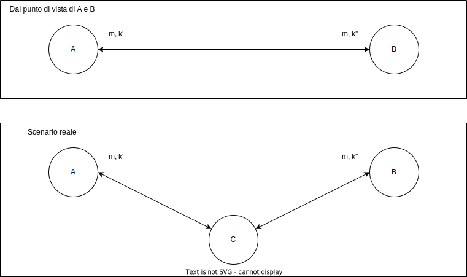
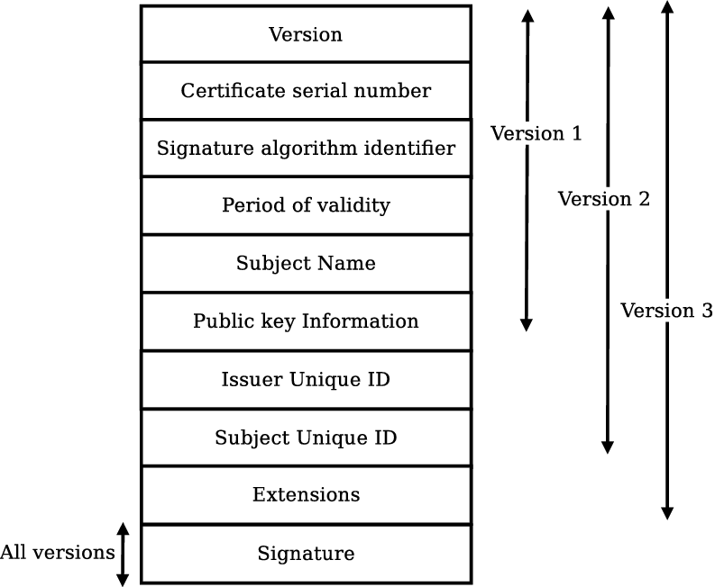

# Robustezza del protocollo Diffie-Hellmann

Il protocollo Diffie-Hellmann "risolve" il problema cruciale della crittografia simmetrica.
Presupposto del protocollo era che affinché gli agenti possano comunicare in maniera sicura ci fosse bisogno che questi condividano una chiave segreta.

Dimostrazione di **correttezza** di Diffie-Hellmann: significa dimostrare che il protocollo adempie al suo scopo funzionale, ovvero ottenere il numero condiviso.

Dimostrazione di **robustezza** di Diffie-Hellmann: che l'attaccante non possa rompere lo schema.

In primo approccio si potrebbe pensare che questa affermazione si basi sul non poter calcolare la chiave al pari di A e B.

Per farlo infatti dovrebbe scoprire uno dei due parametri segreti, $X_a$ oppure $X_b$ (ne basta quindi una). Scoperto uno dei due parametri segreti, ad un attaccante DY basta intercettare la controparte del parametro $Y_a$ o $Y_b$

Possiamo dire con certezza che:
$$
DY \ "conosce" \ X_a \or X_b \Rightarrow DY \ "rompe" \ protocollo \ DH
$$
La robustezza del protocollo si basa sulla robustezza del **problema del logaritmo discreto** già visto.

L'implicazione inversa però non è certa. **Rompere il protocollo DH non implica necessariamente la conoscenza dei parametri privati**. I progettisti del protocollo Diffie-Hellmann infatti hanno **presupposto ma non dimostrato**:
$$
DY \ "rompe" \ protocollo \ DH \Rightarrow DY \ "conosce" \ X_a \or X_b 
$$
Questa implicazione è errata. Possiamo rompere il protocollo senza conoscere i parametri privati.

## Analisi della robustezza

Il protocollo **non prevede l'autenticazione del segreto**, generando così un problema enorme. Condividere un segreto senza avere la certezza del con chi lo si sta condividendo infatti è una falla di sicurezza enorme. Per questo motivo DH è vulnerabile ad un attacco in stile man-in-the-middle.

L'attaccante C ha una sua coppia $X_C$ e $Y_C$ standard. Quando A e B eseguono il protocollo di scambio a C basta mettersi in mezzo, bloccare ed alterare i messaggi legittimi.

1. $ A \rightarrow B : Y_a$ (Bloccato da $C$)
   - $C(A) \rightarrow B: Y_c$ **(1')**
2. $B \rightarrow A : Y_b$ (Bloccato da $C$)
   - $C(B) \rightarrow A : Y_c$ **(2')**

Alla ricezione di  **1'**, B calcola ${Y_c}^{X_b}$ mod $\beta$
Alla ricezione di **2'** , A calcola ${Y_c}^{X_a}$ mod $\beta$

L'attaccante $C$ riesce ad agire in maniera trasparente ai due agenti $A$ e $B$. Ciascuno degli agenti legittimi è convinto di parlare con la controparte. In questo caso non abbiamo un'unica sessione ma due sessione differenti, una tra ogni agente legittimo e l'attaccante. Vista la mancanza di autenticazione $C$ **fa quindi un duplice attacco di segretezza**: utilizzando indebitamente $Y_a$ e $Y_b$.

Ci sono quindi due problemi distinti:

1. Gli agenti legittimi sono convinti di condividere la chiave con l'altro ma la stanno condividendo con l'attaccante
2. L'attaccante conosce **entrambe** le chiavi $k'$ e $k''$

Deduciamo quindi che ci sono **due fix** da fare.

Occorre **introdurre una misura di autenticazione**. Dove introdurla però?
Questo problema è difatti irrisolvibile e motivo per cui si è passati alla cifratura asimmetrica. 

L'utilizzo di cifratura asimmetrica per cifrare le chiavi di sessione impedirebbe all'attaccante il passo **1'**, non potendo somministrare il proprio $Y_c$. Non può cifrarlo con la chiave privata di $A$ (non la possiede) e cifrandola con la propria di fatto **non sta impersonando** $A$.

Va inoltre impedito all'attaccante ci di apprendere (o calcolare) le chiavi di $A$ e $B$. **Gli agente legittimi cifrano con la chiave pubblica del destinatario**, in modo tale che solo questo possa leggerne il valore.

## Irrobustimento di DH: risolvere il man in the middle

Modifica per impedire la parte **1'** dell'attacco:

1. $A \rightarrow B: \{ {Y_a}\}_{{k_a}^{-1}}$
2. $B \rightarrow A: \{ {Y_b}\}_{{k_b}^{-1}}$

Modifica per impedire la parte **2'** dell'attacco:

1. $A \rightarrow B: \{ {Y_a}\}_{k_b}$
2. $B \rightarrow A: \{ {Y_b}\}_{k_a}$

Le misure sono equivalenti. Nel primo caso si agisce sull'autenticazione, nel secondo sulla segretezza.
Nel primo caso $C$ non può cifrare con la sua chiave privata perché non impersonerebbe $A$, o meglio, può provarci ma il tentativo verrebbe stroncato sul nascere.

Nel secondo caso solo il legittimo ricevente può decifrare i messaggi, impedendo a $C$ di ottenere le chiavi di sessione.

:pencil: **Domanda d'esame**: come mai l'attacco a due fix equivalenti?
Esempio di risposta: i fix operano in momenti diversi, il primo sull'autenticazione, il secondo sulla segretezza della chiave. Entrambi impediscono all'attacco di avere un seguito.

# RSA Key Exchange

Un'alternatica a DH, basata direttamente su crittografia asimmetrica è **RSA Key Exchange**.

Il mittente invia una chiave di sessione random e la manda in una **busta digitale** (un messaggio firmato con la chiave pubblica). In questo caso esemplificato manca l'autenticazione, **non è quindi equipollente a DH rinforzato** (di conseguenza è soggetto anche esso a man-in-the-middle).
$$
A \rightarrow B : \{ {k_{ab}}  \}_{k_b}
$$
Affinché il protocollo funzioni, $A$ deve procurarsi il **certificato** (della chiave pubblica) di $B$

# Certificazione (crittografia asimmetrica)

Le autorità di certificazione "vendono trust". Nello specifico, la trust è più basata su quanto **il ricevente ultimo di questo certificato voglia riconoscere trust al certificato**. La fiducia in un certificato dipende quindi dalla **fiducia che si ha nell'ente certificatore**. Normalmente dietro gli enti certificatori ci sono stati consorzi di banche, quindi coloro che avevano molti interessi economici in ballo.

Alcune autorità di certificazione (CA):

- Verisign
- AOL
- Thwate

Il formato standard del certificato si chiama **X.509**

## Struttura di un certificato X.509

:pencil: **Domanda d'esame**: spiegare le differenze tra le varie versioni del certificato.
Esempio di risposta: indicare i campi in più per ogni versione.

## Cosa fare una volta ottenuto un certificato digitale?

1. Verificare che l'ente certificatore sia legittimo (applicare l'algoritmo di verifica della firma al certificato)
2. Legge i contenuti del certificato e li apprende.

## Gerarchia dei certificati

Gli enti certificatori seguono una gerarchia.

La verifica del certificato avviene attraverso la chiave pubblica dell'ente certificatore, per cui serve a propria volta un certificato di più alto livello.

L'ente certificatore di livello $n$ quindi certifica la validità dell'ente $n-1$ esimo, generando una **Chain of Trust**.

Nell'ente certificato di più alto livello $CA_0$ (anche **RootCA, RCA** o **primaryCA**) le firme sono dello stesso livello architetturale (ovvero sono **auto-certificati**).

------

**Elenco di lettura**

- [Certificate authority](https://it.wikipedia.org/wiki/Certificate_authority)

