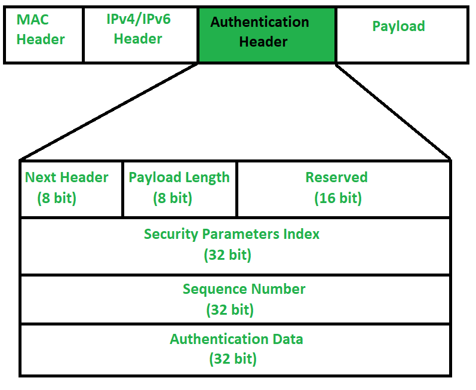
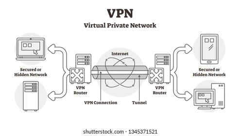
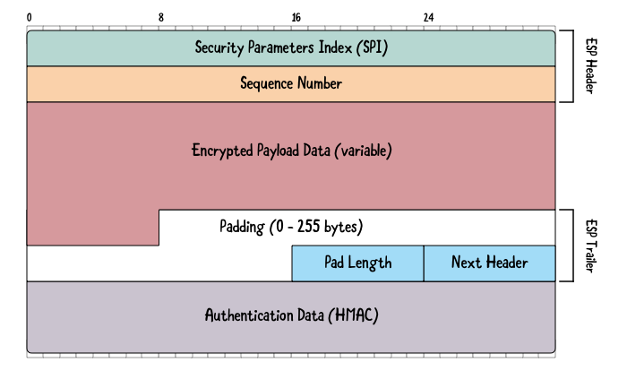
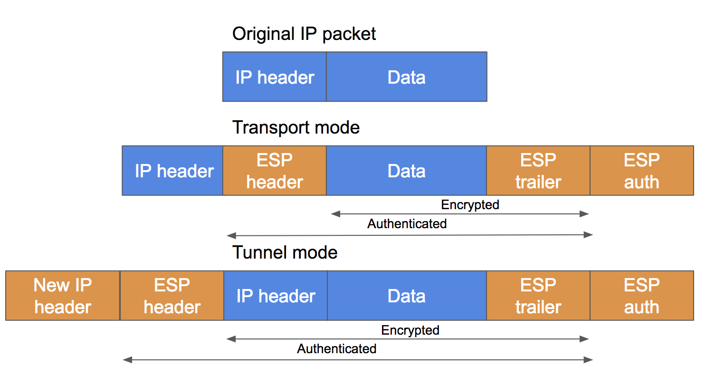

# Osservazioni sulla complessità dei protocolli

Maggiore è la complessità di un protocollo maggiore è la possibilità che questo abbia il suo interno delle vulnerabilità. Per protocolli come Needham-Schroeder, pur essendo relativamente semplici, c'è voluta una quindicina d'anni per scoprire una vulnerabilità che, con la mentalità moderna, sarebbe stata evidente. Protocolli considerati ad oggi evoluti, complessi e maturi, come SSL e SET, potrebbero nascondere al proprio interno vulnerabilità critiche di cui però ignoriamo l'esistenza.

# IPSEC

I modi in cui IPSEC può essere utilizzato sono molteplici, variabili a seconda della policy seguita. Data una policy istituzionale, l'implementazione di questa in IPSEC può essere fatta in modalità:

- **trasporto**
- **tunnel**

A seconda della modalità scelta sono garantite proprietà di sicurezza differenti.

La policy adottata prende il nome di security association (SA), una relazione unidirezionale tra mittente e destinatario. Per creare un canale di comunicazione bidirezionale servono due SA.

La security association definisce il protocollo di sicurezza richiesto per il traffico trasportato (AH oppure ESP).

Una SA ha almeno tre campi:

1. **SPI (Security Parameter Index)**: un ID per indicare la policy
2. **Indirizzo IP di destinazione**: solo unicast
3. **Identificazione del protocollo AH e/o ESP**

## Security association database (SAD)

In presenza di più SA come viene gestito il tutto? Cosa deve fare un nodo della rete che voglia essere IPSEC-compatibile?

Un nodo IPSEC-compatibile deve poter conoscere ed individuare la SA e poterla implementare, per fare questo mantene un database di SA.

In particolar modo un SAD oltre ai campi delle SA contiene anche, per ogni entry:

- **AH info**: informazioni sull'algoritmo di autenticazione usato
- **ESP info**: informazioni sull'algoritmo di codifica
- **Lifetime**: durata della SA

Queste informazioni aggiuntive hanno uno scopo funzionale per il nodo.

:pencil: **Domanda d'esame**: quanti e quali  sono i campi del SAD per ogni entry?
Risposta: 6. SPI, indirizzo IP di destinazione e identificativo del protocollo che costituiscono la SA + informazioni aggiuntive su AH, ESP e tempo di vita della specifica SA.

Il tipo di traffico, ovvero i pacchetti IPSEC, specifica il tipo di policy da applicare. Il pacchetto in sé trasporta quindi informazione, che il nodo può interpretare, per indicare "il modo in cui va utilizzato". Questa informazione risiede nel campo **SPI**.

Il SPI è un punto cruciale, perché poterlo falsare significherebbe poter attribuire policy differenti al pacchetto. Dobbiamo quindi garantire integrità del pacchetto. Lo facciamo attraverso il protocollo AH.

## Authentication Header (AH)

Gli obiettivi di AH sono **autenticazione** ed **integrità** (tra loro inscindibili per i motivi già visti).

Attraverso il protocollo **IKE** mittente e ricevente **pre-concordano** le primitive crittografiche (le chiavi di sessione) da utilizzare per l'autenticazione.

Il bisogno di dover pre-concordare le chiavi non porta con sé un problema di scalabilità visto che solo i nodi agli estremi (appunto mittente e ricevente) devono scambiarsi le chiavi. Si pone però il problema di come gli altri nodi di mezzo possano partecipare al routing **pur non comprendendo il payload**.

L'obiettivo è quindi che i nodi intermediari non possano alterare le tre proprietà fondamentali ma **possano solo contribuire all'inoltro**.

Il protocollo AH pone integrità sul pacchetto IP, tranne per gli header IP variabili (type of service, flags, fragment offset, TTL etc...), modificabili dai nodi intermedi.

Grazie ad AH IPSEC previene replay attack (garantisce freshness) e IP spoofing.

## Formato dei pacchetto con AH

Al campo Autentication Data troviamo il MAC del pacchetto incapsulato dall'AH.

Qualunque alterazione del pacchetto è rilevata dal MAC. Facendo la verifica del MAC il ricevente ha evidenza di eventuali alterazioni e può "buttare via" i pacchetti che ritiene alterati.

## Prevenzioni di replay attack grazie ad AH

Grazie al **sequence number** dell'AH abbiamo garanzia di freshness. Il **meccanismo a finestra tradizionale**, tipico dei protocolli che utilizzano numeri di sequenza, permette quindi di scartare i pacchetti vecchi, ripetuti e falsificati.

Se il pacchetto ricevuto sta nella finestra e il controllo del MAC è andato a buon fine allora è valido, la relativa posizione all'interno della finestra viene marcata.

È il controllo di integrità sul MAC a permettere al ricevente di scoprire eventuali tentativi di falsificazione, impedendo che eventuali pacchetti spediti appositamente con numeri di sequenza appartenenti finestra possano venir spacciati per leggitimi.

Va da sé che il meccanismo a finestra da solo non può rappresentare un protocollo di sicurezza.

:pencil: **Domanda d'esame**: qual è il meccanismo anti-replay di IPSEC?
Risposta: l'insieme di meccanismo a finestra insieme al controllo sul MAC.

## Funzionamento base di IPSEC

1. Ogni mittente sceglie una SA usando il proprio SPD (Security Policy Database)
2. L'SPI della SA scelta viaggia con l'header AH, per ogni pacchetto
3. Ogni nodo attraversato guarda l'header AH e preleva l'SPI per selezionare dal proprio SAD la SA relativa al pacchetto

Questo vale **esclusivamente per i nodi IPSEC-compatibili**.

Cosa avviene se il nodo non è IPSEC-compatibile però?

In **modalità trasporto** qualunque nodo può leggere l'header AH e sapere dove inoltrare il pacchetto, contribuendo al routing. Se il nodo intermedio è anche IPSEC compatibile può fare una verifica di integrità del pacchetto e buttarlo via prima ancora che questo raggiunga l'indirizzo di destinazione.

In **modalità tunnel** (anche conosciuta come VPN) viene aggiunto un ulteriore header al pacchetto.

|                                    | Modalità trasporto                                           | Modalità tunnel                                              |
| ---------------------------------- | ------------------------------------------------------------ | ------------------------------------------------------------ |
| Cosa AH protegge attraverso il MAC | Dati del pacchetto + Campi non variabili dell'header IP (no IP spoofing) | L'intero pacchetto IP (dati + tutti gli header IP), compresi i campi non variabili dell'IP esterno (impedisce IP spoofing) |

IPSEC tunnel da solo garantisce un tunnel sicuro da una rete locale ad un'altra, tuttavia non protegge da inside threath.

Il tunnel IPSEC è stabilito **tra due gateway di due reti locali differenti**.

Utilizzando la struttura a tunnel il sistema è perfettamente retro-compatibile ed un nodo non IPSEC-compatibile partecipa tranquillamente al routing.

## Encapsulation Security Payload (ESP)

Quanto visto fino ad ora forniva una garanzia di integrità ed autenticazione ma non di segretezza. ESP garantisce invece la proprietà di segretezza.

Notare bene che i campi SPI e sequence number sono lasciati in chiaro. Come per AH in modalità tunnel il pacchetto ESP è incapsulato con un nuovo IP.

In questo scenario solo il gateway VPN remoto può estrarre il contenuto del pacchetto, conoscendo la chiave di sessione necessaria per decifrare il pacchetto.

## Combinazioni di SA

È possibile combinare più SA insieme. Se si sceglie di combinarle va da sé che un nodo che voglia essere IPSEC-compatibile debba implementarle tutte e quattro. Può servire combinare più tunnel ad esempio.

- **Tipo 1**
  - AH in trasporto oppure ESP in trasporto (host-to-host)
- **Tipo 2**
  - AH in tunnel oppure ESP in tunnel (gateway-to-gateway, VPN)
- **Tipo 3**
  - Combina le due precedenti
  - Da host a gateway sinistro in AH ed ESP in trasporto
  - Da gateway sinistro a destro AH ed ESP in tunnel
  - Da gateway destro ad host ricevente in trasporto
- **Tipo 4**
  - Da host sinistro a gateway remoto tipo 1
  - Da gateway ad host destro tipo 2

[Vedere slide per immagini d'esempio]

Il tipo 3 è la misura più sicura, che va in profondità, ottima in un ambiente di zero-trust. Questa soluzione richiede IPSEC su tutte e quattro le macchine.

Anche il tipo 4 è un ottima difesa in profondità.

## Internet Key Exchange (IKE)

Suite di protocolli utilizzata per generare le chiavi che poi verranno utilizzate da AH e/o ESP.

- **Oakley** (variante di Diffie-Hellmann, livello applicazione): fornisce chiave di sessione iniziale
- **ISAKMP** (Internet Security Association and Key Management Protocol, livello trasporto): crea chiavi di sessione usando la chiave iniziale

# Intrusion Detection System (IDS)

A differenza dei firewall gli IDS sono sistemi più articolati e complessi, che devono rilevare i **processi alieni**, insiders compresi. Il firewall non si occupa di intrusioni in questo senso ma guarda esclusivamente il traffico. 

È estremamente difficile per gli IDS scremare falsi positivi e falsi negativi perché è complicato capire se un certo comportamento sia naturale (di un processo legittimo) oppure malevolo.

Tecniche di machine learning possono essere utilizzate per migliorare i sistemi di ID ma l'ambito rimane euristico, senza risposte e soluzioni assolute.

Virus, warm e malware sono concetti differenti dall'intrusione, sebbene possano essere utilizzati per progettarne una. Anche il concetto di DOS è differente da quello di intrusione.

------

**Elenco di lettura**

- Group-key distribution
- PRF (Pseudo-random function)