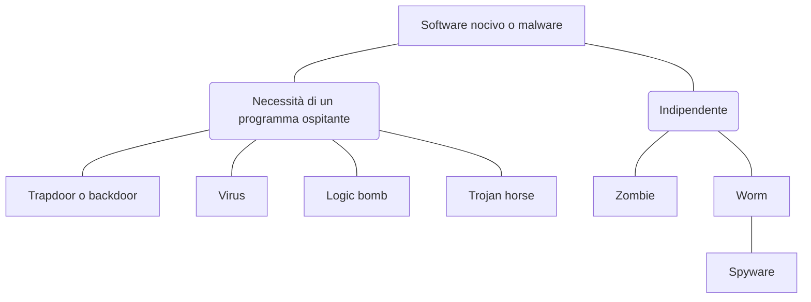

# Attacchi DoS

:notebook_with_decorative_cover: **Definizione**: attacco che impedisce la normale operatività di un sistema, degradandola o bloccandola del tutto.

Ci sono vari scenari che si prestano al DoS. Uno degli scenari più comuni al giorno d'oggi è lo scenario del **DDos**, ovvero quello **distribuito**. Un insieme di macchine remote, trasformate in "**zombie**" (si parla tipicamente di botnet), viene utilizzato per attaccare un certo servizio. Un esempio tipico è quello dello sfruttamento di vulnerabilità di alcuni sistemi di telecamere, trasformate in zombie.

## Reagire ad un attacco DoS (o DDoS) con Cookie Transformation

L'approccio più brutale e non funzionale di fronte ad un attacco DoS è chiudere le connessioni. Si può in maniera euristica anche filtrare il numero di connessioni. Questi approcci però portano l'applicazione a non essere funzionale (e funzionante) quindi non sono soluzioni adottabili se non in casi estremi.

Un'altra euristica famosa è la **cookie transformation**, dove il server invia al client un cookie che quest'ultimo deve trasformare opportunamente e re-inviare, prima che il server fornisca quanto richiesto.

La trasformazione è relativamente semplice per entrambi ma è un modo (per il server) per verificare che ci sia un client attivo dall'altro lato. In questo modo si fronteggiano i loop infiniti che fanno richieste, tipici degli attacchi DoS più semplici.

Caso semplice di richiesta-risposta:
$$
1. \ C \rightarrow S: m1 \\
2. \ S \rightarrow C: m2 \\
3. \ C \rightarrow S: m3 \\
$$
Con cookie transformation:
$$
1. \ C \rightarrow S: m1 \\
2. \ S \rightarrow C: m2_s \\
3. \ C \rightarrow S: m1, m2_s, h(m1,m2_s) \\
4. \ S \rightarrow C: m2_c
$$
# Intrusione

:notebook_with_decorative_cover: **Definizione**: Ottenere illecitamente privilegi superiori a quelli posseduti lecitamente. 

Un intrusione consiste quindi sia nell'accedere ad un sistema per cui non si avrebbe normalmente accesso, sia aumentare i propri privilegi se già ne si ha.

Tecniche di intrusione:

- Violazione di password
- Intercettazione di informazioni sensibili
- Uso di combinazioni di software novico

Trattare le intrusioni:

- **intrusion detection**
- **intrusion prevention**

# Intrusione vs DoS

:pencil: **Domanda d'esame**: che differenza c'è tra intrusione e DoS?

| DoS                     | Intrusioni                   |
| ----------------------- | ---------------------------- |
| Effetti temporanei      | Effetti di solito permanenti |
| Immediatamente pubblico | Spesso non reso pubblico     |
| Blocco delle risorse    | Uso illecito di risorse      |

# IDS (Intrusion Detection System)

Come accennato in precedenza, i **sistemi di rilevamento di intrusione** moderni sono spesso arricchiti con AI e quindi risultano non deterministici. I falsi positivi sono inscindibili da questo tipo di sistema. Gli strumenti più tradizionali invece non usano tecniche machine-learning. In particolare **Snort** è un IDS open source molto comune che usa tecniche tradizionali.

I meccanismi basilari per intrusion detection sono i **log**.

I **SIEM** sono strumenti più evoluti degli IDS, che utilizzano tecniche di intrusion detection, loggano e poi vi applicano tecniche per identificare e prevenire le intrusioni.

**Fare logging è relativamente facile, prendere delle decisioni in merito è l'aspetto critico.** Sul piano applicativo ed economico **fare logging è costoso** perché bisogna predisporre gli applicativi ed istanziare volumi per conservare i dati di log.

:pencil: **Domanda d'esame**: qual è lo strumento basilare per l'intrusion detection?
**Risposta**: il log ma non basta solo quello, va analizzato e vanno prese delle decisioni.

Si possono definire i comportamenti malevoli:

- **con tecniche intelligenti**
- **con statistiche, analizzando il comportamento medio nel tempo**

**Problemi**: falsi positivi e falsi negativi.

## Strumenti di logging: i record di auditing

Abbiamo come strumenti di logging:

- **record nativi**: dei sistemi operativi, che tengono informazioni generali sulle attività degli utenti, ad esempio lo storia dei comandi della shell.
- **record specifici per il rilevamento**: software aggiuntivo che raccoglie informazioni apposite. Appesantisce il sistema ma da informazioni più accurate.

### Record di Denning

Un record specifico è ad esempio il **record di Denning**, un esempio storico.

Contiene:

- **soggetto**
- **azione**
- **oggetto**
- **eccezione**
- **uso di risorse**
- **timestamp**

Somiglia ad una policy per i primi 3 punti.

## Tecniche di detection

Dividiamo le tecniche di rilevamento in:

- **Tecniche assolute, ovvero indipendenti dal passato**: ad esempio max di 3 fallimenti per l'inserimento della password.

- **Dipendenti dal passato**: di tipo statistico, si assume che il futuro andrà come il passato (il che non è sempre vero)

I modelli di rilevamento sono di due tipologie:

- **Rilevamento statistico**: costruito un modello dell'utente legittimo, se lo scenario live diverge dal modello viene segnalata l'intrusione (il tipo dipendenza dal passato citato prima è di ispirazione statistica)
- **Rilevamento a regole**: basato sulle regole. L'IDS Snort è basato su regole.

### Modelli per il rilevamento statistico

- media e deviazione standard
- modello operativo ( a soglia )
- multivariazione
- processo di Markov (meglio noto come catene di Markov)
- Serie temporale

Esempi di rilevamento statistico

| Parametro                                                    | Modello                     | Tipo di intrusione rilevata                                  |
| ------------------------------------------------------------ | --------------------------- | ------------------------------------------------------------ |
| Frequenza di login, in base a giorno e ora                   | Media e deviazione standard | Tentativi di login ad orari non abituali possono rappresentare un'intrusione |
| Frequenza di login, in base alla posizione / località        | Media e deviazione standard | Intrusione da una particolare località mai registrata o da cui l'utente raramente ha effettuato l'accesso |
| Tempo trascorso dall'ultimo login                            | A soglia                    | Effettuare l'accesso ad un account che non veniva acceduto da tempo potrebbe indicare un intrusione |
| Quantità dell'output rispetto alla posizione                 | Media e deviazione standard | Un'eccessiva quantità di dati da una località remota può significare che c'è stato un leak di dati sensibili |
| Utilizzo delle risorse                                       | Media e deviazione standard | Un utilizzo anomalo o eccessivo delle risorse (computazione ed I/O) può essere indicativo di un'intrusione |
| Numero di fallimenti durante il login                        | A soglia                    | Tentativo di accesso con guessing                            |
| Numero di fallimenti durante il login da un applicativo specifico | A soglia                    | Tentativo di accesso                                         |

Dato un parametro, questo è studiabile con più modelli statistici, alcuni si prestano meglio più di altri ad un certo modello. Ad esempio gli errori sulla password si prestano bene alla soglia operazionale, l'orario di inserimento di una password invece si presta bene alla deviazione standard.

**Esempio 1, controllo a soglia**
Tempo intercorso dall'ultimo login con il modello a soglia: se passa più di una settimana è un tentativo di login ad un account abbandonato.

**Esempio 2, rilevamento statistico su esecuzione dei comandi**
Studiato con media e deviazione standard, visti quali comandi di solito l'utente utilizza e se c'è un'insieme di comandi anomali viene riportata l'anomalia. Tanti comandi in massa possono indicare un'intrusione.

### Rilevamento a regole

Esempi di IDS con rilevamento a regole sono **Snort** e **ntop**. Questi sistemi attingono a grossi **database di regole**, fatte apposta per identificare le intrusioni.

Alcune tecniche di protezione:

- **limitare l'automazione**
- **usare honey pot**

## Osservazioni

Misure anti brute-forcing e di intrusion detection sono di ispirazione comune ma spesso differenti. Tipicamente quelle di intrusion detection sono più basse, superate le quali avvengono le segnalazioni.

# IMS (Intrusion Management System)

La gestione delle intrusioni è ormai un processo standardizzato.

**L'intrusione va:**

1. **Contenuta (containment)**
2. **Rimossa (eradication)**
3. **Riassorbita (recovery)**
4. **Punita (punishment)**

# Malware

Un **bug** è una **proprietà inattesa** del software. L'intenzionalità del danno in questo caso è non voluta. Un bug spesso può rappresentare una vulnerabilità.

Il software nocivo o **malware** è scritto con lo scopo di violare la sicurezza di un sistema, è quindi contraddistinto dalla sua intenzionalità. Un malware può sfruttare i bug per adempiere al proprio scopo. Malware è un termine ombrello che identifica quindi il software nocivo.

Caratteristiche di un malware:

- **Payload** (carico)
- **Propagazione**

## Tassonomia del software nocivo

**Solo virus, worm e zombie si propagano**.

### Backdoor

Una backdoor è un punto di accesso segreto, lasciato **volontariamente**, tipicamente per motivi di testing del software.

### Logic bomb

È un frammento di codice che aspetta un determinato istante (una serie di condizioni) per attivarsi.

### Trojan Horse

Un programma utile o apparentemente utile che a run-time compie una violazione di sicurezza. Utilizza spesso backdoor o bug per i propri scopi.

### Zombie

Programma nocivo che sfrutta la macchina remota per i propri scopi malevoli.

### Worm

Un programma indipendente che infetta le macchine remote, ciascuna delle quali infetta altre macchine remote.

#### Worm di Morris

Un worm storico risalente ai primi anni 80/90.

- **Payload**: un loop infinito che diffonde il worm all'interno della macchina
- **Propagazione**:
  - sfrutta tre bug noti di UNIX per violare la macchina remota
    - **Attacco known-cipertext** su file `passwd`
    - Buffer overflow mediante deamon `finger`
    - Backdoor nel programma `sendmail`
  - Scarica 99 linee di codice C. Si auto-compila ed esegue, scaricano poi l'intero worm (**post-exploitazione**).

##### Struttura dell'attacco known-ciphertext

Le tre colonne del file delle password al tempo erano leggibili, per quanto le password fossero cifrate.

Il worm di Morris prova a codificare possibili candidati per l'hash delle password, utilizzando delle strategie di ingegneria sociale:

- username e le sue permutazioni
- una lista di circa 400 propri candidati statistici
- tutte le parole nella directory locale `/local`

Se l'approccio andava a buon fine otteneva le credenziali d'accesso per la macchina remota.

Quando questa strategia non andava a buon fine, passava allo sfruttare il BOF su `finger`.

##### BOF mediante `finger`

Lanciato `finger`, la macchina remota rispondeva utilizzando `fingerd`. Faceva buffer overflow sul buffer di input di `fingerd`. `fingerd` prima di terminare eseguiva la shellcode caricata nel buffer, che scarica il codice del worm.

##### Backdoor in sendmail

Viene eseguito sendmail in background e si utilizza la backdoor di `debugging mode`, grazie a cui era possibile eseguire i comandi. Grazie a questo approccio veniva scaricato il codice del worm.

### Virus

Un programma nocivo che viola altri programmi non nocivi, sfruttandoli per propagarsi. Nella sua forma più semplice può essere rappresentato dalla manipolazione di un file. Esistono poi forme più sofisticate.

------

**Elenco di lettura**

- [Perché il SIEM è importante?](https://www.ibm.com/it-it/topics/siem)

