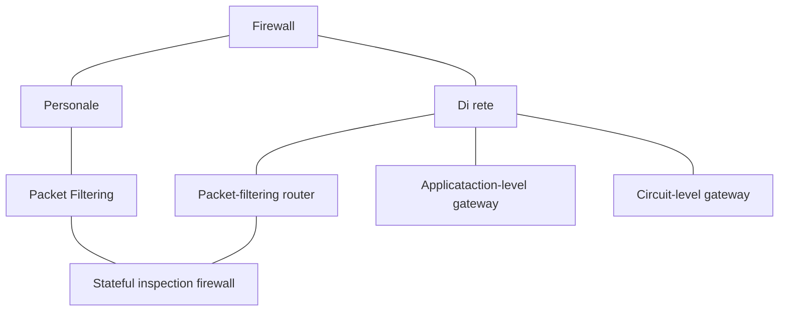

# Virus

:notebook_with_decorative_cover:**Definizione**: programma nocivo che viola altri programmi non nocivi, sfruttandoli per propagarsi.

Mentre il worm è indipendente, il virus sfrutta altri programmi per propagarsi.

Il virus di per sé è un concetto semplice e non implica necessariamente l'exploitazione di una vulnerabilità, che è un concetto molto più sottile.

## Macrovirus

In ambito Office ed affini sono disponibili le macro, ovvero delle porzioni di codice che il programma può eseguire. Le macro sono pensati per realizzare operazioni forbite per fogli di calcolo, documenti di testo e simili.

In questo modo però è anche possibile passare file contenenti script malevoli.

Le policy sull'eseguibilità delle macro con il tempo è diventata più stringente , fino alla disabilitazione di default, e quindi questa strategia è caduta in disuso

:pencil: **Domanda d'esame**: che cos'è un macrovirus?

## Struttura di un virus

- Firma
- Porzione di codice utilizzata per replicarsi in altri file
- Sub-rutine che esegue il damage
- Restituzione del controllo al programma ospitatante

## Dove inserire un virus

Il codice del virus può decidere dove andarsi a piazzare.

- All'inizio
- Alla fine
- All'inizio e alla fine
- In mezzo

Un modo per verificare se un file è stato infettato è verificare la dimensione del file. Tuttavia un virus può utilizzare anche tecniche di compressione per mascherare il codice malevolo aggiunto

:pencil: **Domanda d'esame**: che livelli di danno possono fare i virus?
**Esempio di risposta**: i virus possono solo danneggiare i file legittimi oppure oltre a danneggiarli possono appendervi il proprio codice.

## Distinzione tra i vari tipi di malware

| Tipo                | Si replica | Caratteristiche principali                                   |
| ------------------- | ---------- | ------------------------------------------------------------ |
| Trapdoor o backdoor | No         | Concede un accesso non autorizzato                           |
| Logic bomb          | No         | Si attiva solo su specifiche condizioni                      |
| Trojan              | No         | Ha funzionalità illecite inattese                            |
| Virus               | Sì         | Attacca un programma e si propaga attraverso più mezzi, anche fisici |
| Zombie              | Sì         | Usa una macchina già violata per attaccare                   |
| Worm                | Sì         | Viola le macchine ricorsivamente e si propaga attraverso la rete. È indipendente. |

## Esempio di virus: Brain

- Attaccava i sistemi Microsoft
- Rinominava il volume del disco in "BRAIN"
- Alcune versioni cancellavano frammenti di dati
- Si propaga

### Payload di Brain

- Viene caricato nella parte alta della memoria ed esegue una chiamata di sistema per resettare il limite della memoria che lo contiene, imposta il limite al di sotto
- Prende la porzione 19 del vettore degli interrupt che contiene l'indirizzo della procedura per gestire le letture su disco
- Setta al posto dell'indirizzo legittimo il proprio

### Propagazione di Brain

- Visto che è in grado di gestire le letture grazie al payload, controlla che i byte 5 e 6 contengano la propria firma "1234"
  - Se no infetta 6 settori a caso
  - Se si si ferma e si propaga con i dati

### Extra

- Poteva marcare i settori infetti come danneggiati in modo tale che il sistema operativo non li usasse più
- Iterava il meccanismo di propagazione fino a quando c'erano settori non infettati sul disco
- Riduce lo spazio disponibile del disco

# Rimozione del software notivo

- Antivirus
- Immune system
  - sfrutta gli antivirus
  - sistema di rilevamento distribuito ispirato a quello del corpo umano
- Software sentinella

# Antivirus

Ha tre compiti principali:

1. **Individua** il problema
2. **Identifica** il tipo di software malevolo
   - Tipicamente dalla firma
3. **Elimina** il problema
   - Non sempre è fattibile

## Prima generazione di antivirus

Programma che l'utente eseguiva a sua discrezione. Confronta i risultati con un database di firme.

1. Scansiona i file e li confronta con le firme del database
2. Scansiona i file alla ricerca di variazioni della loro lunghezza rispetto alle lunghezze standard

Questo approccio era accettabile per memorie di massa piccole.

## Seconda generazione di antivirus

Basati su euristiche.

- Ricerca di frammenti di codice (spesso) associati ai virus
- Ricerca di violazioni di integrità

## Terza generazione di antivirus

Programma che risiede in memoria e rimane sempre attivo. Ricerca ed identifica azioni illecite, bloccandola appena la rileva.

## Quarta generazione di antivirus

Simile alla terza ma include la capacità di ri-regolare il controllo di accesso per limitare la propagazione di un virus trovato (capacità di reazione).

# Firewall

I firewall sono una misura di sicurezza **preventiva** che normalmente lavora a livello di rete. Esistono anche firewall commerciali di natura applicativa.

Il firewall ha quindi senso solo se è installato in un sistema hardenizzato e non prevenire intrusioni su altri punti di accesso non protetti.

:notebook_with_decorative_cover: **Definizione**: dispositivo che fa enforcing di una policy per il controllo di traffico tra due reti o sotto-reti con impostazioni di sicurezza (e quindi di fiducia) diverse.

Ad esempio se dietro un firewall è presente un web server che è pubblico, il firewall gestirà le porte 80 e 443.

Il firewall può anche essere utilizzato per contrastare le inside treath ma va configurato opportunamente una DMZ (con due o più firewall).

## Requisiti di un firewall

- Tutto il traffico deve passarvi attraverso
- Il passaggio del traffico è regolato da **apposite policy di sicurezza**
- Il firewall deve essere "sicuro", installato su **bastion host**

## Funzionalità di un firewall

Nella sua configurazione base è inoltre relativamente facile da raggirare in quanto basta fare IPSpoofing per mascherare l'origine. Il firewall inoltre tiene più in conto l'indirizzo di destinazione.

Limitandosi ad osservare il traffico e negare o consentire l'accesso sulla base di provenienza e destinazione (ma non del payload) di per sé non può rilevare minacce particolari, per questo motivo è opportuno accompagnarlo con un IDS.

I prodotti commerciali tipicamente contravvengono al principio di bastion host e offrono tanti altri servizi, come il NATting e il DHCP.

## Policy di sicurezza del firewall

1. **Default deny**: di default tutto quello che non è espressamente permesso è vietato
2. **Default permit**: di default tutto quello che non è espressamente vietato è permesso

Tipicamente i firewall usano dei sistemi di priorità per ovviare alle incoerenze.

## Limiti del firewall

- Non proteggono da attacchi che ricevono il permesso di oltrepassarlo (connessioni dirette)
- Non proteggono da insider threat
- Non leggono il payload quindi difficilmente proteggono da software nocivo
- Possono degradare le prestazioni
- Possono essere difficili da configurare
- Non possono proteggere da attacchi zero day

## Tassonomia

### Firewall personale

- Protegge solo la macchina su cui è installato
- Ad oggi è ancora molto diffuso
- Molto adatto ai dispositivi mobili
- Utilizzabile insieme a firewall di rete

### Packet-filtering router

- Lavora a livello di rete
- Applica un insieme di regole ai pacchetti in ingresso ed in uscita
  (tipicamente più stringenti in entrata che in uscita, come si vede con gli exploit reverse shell)
- Le regole sono basate sulle informazioni contenute nel pacchetto
- Applicate con proprietà decrescente

#### Regole di filtering

Vengono osservati per decidere:

- **IP sorgente**
- **IP destinazione**
- **Indirizzi sorgente e destinazione di livello di trasporto**
- **Protocollo IP**
- **Interfaccia di provenienza e destinazione**

Ovviamente non tutte le interfacce dei firewall sono così. Alcune sono più semplici o più complesse. Il firewall può inoltre leggere le regole in maniera crescente o decrescente a seconda della sua implementazione, di conseguenza volendo scrivere una regola per il firewall dobbiamo decidere se appenderla o prependerla.

Le regole possono essere definite per connessioni bidirezionali o unidirezionali. Firewall complessi possono permettere traffico su porte alte ma non su porte basse, accettare o meno messaggi di ACK, su porte specifiche etc...

### Statefull inspection firewall

Concede dati solo sulla porta richiesta e tiene traccia dello stato della specifica connessione 

------

**Elenco di lettura**

- [File Integrity Monitoring Definition](https://www.beyondtrust.com/resources/glossary/file-integrity-monitoring)