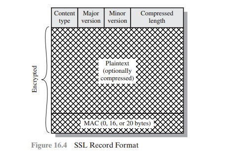

# HTTPS

HTTPS è il protocollo più comune ad oggi per quanto riguarda il web. È un porting di SSL su HTTP.
SSL nasce con la Netscape Foundation, TLS è la sua versione generalizzata.

Questi protocolli possono essere aggiunti a varie applicazioni, come:

- email: S/MIME
- pagamenti: 3D-Secure 

Presentato nell' **RFT 2818**. Il servizio HTTPS è esposto sulla porta **443**. Cifra contenuti, moduli, cookies ed header di HTTP.

Uno **special header** moderno di HTTPS inviato dal server al browser è **HTTP Strict Transport Security (HSTS)**, utilizzato per evitare gli **attacchi di stripping SSL**.

# Attacchi di stripping SSL

- **Versione 1**, prevenuto da HSTS
  - il man-in-the-middle restituisce all'utente il sito da lui richiesto ma in HTTP, anziché HTTPS (fa un downgrade). Attacco di tipo **socio-tecnologico**.
- **Versione 2**, non prevenuto da HSTS
  - cambio di dominio. Il man-in-the-middle fornisce all'utente un sito differente, il cui dominio e apparenza sembrano quelli del sito originale. Il sito servito dall'attaccante può essere sia HTTP che HTTPS.

# SSL / TLS

SSL / TLS si trova tra TCP ed HTTP. Costruisce un layer di sicurezza tra i due livelli. Può anche essere visto come un'integrazione di HTTP.


## Cenni storici

- Nel **1994** SSL v2 viene sviluppato da Netscape.

- Nel **1995** viene presentato SSL 3.0 con l'**RFC 6101**

- Nel **1999**: IETF standardizza il protocollo TSL

**TLS è quindi la versione standardizzata di SSL**, leggermente più recente.

## Suite di protocolli SSL

Ad oggi SSL non è più un semplice protocollo ma una suite di protocolli.


- È il **Record Protocol** che "fa la sicurezza" in SSL, attraverso l'utilizzo di materiale crittografico (usa la chiave per applicare la cifratura).
- **SSL Handshake Protocol** è invece utilizzato per scambiare il materiale crittografico utilizzato dal Record Protocol.
- Il **Change Cipher Spec Protocol** fornisce invece sincronizzazione.
- **Alert** invece fornisce un modo per scambiare messaggi importanti di tipo alert.

### SSL Record Protocolo


Viene aggiunto al singolo frammento il MAC (fatto con la chiave simmetrica condivisa ottenuta dall'Hand-shake Protocol), così da **garantire integrità**. Viene poi applicata l'encryption e appeso l'header per capire come trattare il pacchetto.

### MAC su SSL

Il MAC su SSL è un **hash annidato**. Il primo schema presentato per il MAC su SSL nel 1995 è così fatto:

```c++
hash(
	MAC_write_secret || pad_2 || # padding per ottenere l'hash
	hash(
		MAC_write_secret || pad_1 || seq_num ||
		SSLCompressed.type || SSLCompressed.length ||
		SSLCompressed.fragment
	)
)
```

**Il tipo di compressione applicata al MAC è un informazione che bisogna conoscere per costruire il MAC**. La **chiave di sessione** è la `MAC_write_secret`

### Record Header

Per funzionare, il Record Protocol ha bisogno che lo scambio di chiavi sia andato a buon fine.

Stuttura dell'header.

- **Content type**: il tipo di protocollo di livello superiore adottato
- **Major version**
- **Minor version**
- Lunghezza del pacchetto compresso: numero di byte del pacchetto in chiaro

Per fare l'encription **non viene utilizzata** la `MAC_write_secret` così da garantire separazione degli ambienti e maggiore sicurezza.



L'immagine è la versione espansa dell'ultimo header in cui è incapsulato il pacchetto dell'immagine precedente.
Notare bene che l'immagine in realtà ha un refuso perché indica il MAC come opzionale (0 byte).

### SSL Change Cipher Spec Protocol

Il protocollo di hand-shake stabilisce una **cyber-suite** (preferenze crittografiche). Il protocollo **CCSP** si occupa di **ufficializzare** la scelta delle preferenze crittografiche. Può essere visto come un clock od un flag.

### SSL Alert Protocol

Protocollo per lo scambio di messaggi di alert. Fatto da messaggi formati da due campi:

- **livello**: specifica la gravità
- **codice**: specifica il tipo di alert

Esempi di fatal alert:

- `unexpected_message`
- `bad_record_mac`
- `decompression_failure`

Esempi di warning alert:

- `unsupported_cert`
- `cert_revoked`
- `cert_expired`

I fatal alert portano ad un blocco del protocollo, i warning vanno attenzionati, per quanto non portino al blocco. Il protocollo di alert è protetto. Il browser utilizza ad esempio il protocollo di alert per informare l'utente quando ad esempio il sito espone un certificato scaduto.

### Protocollo di hand-shake

- stabilisce un **Master Secret**  che è una chiave di sessione tradizionale

- i vari MAC e segreti **vengono derivati dal Master Secret utilizzando funzioni pseudo-random**

- Il formato dei messaggi é:

  - **Type**

  - **Length**

  - **Content**

    | Message Type                       | Parametri                                                    |
    | ---------------------------------- | ------------------------------------------------------------ |
    | hello_request (da server a client) | null                                                         |
    | client_hello                       | version, random, session id, cipher suite, compression method |
    | server_hello                       | version, random, session id, cipher suite, compression method (come il client) |
    | certificate                        | chain di certificati X.509v3                                 |
    | server_key_exchange                | parametri, signature                                         |
    | certificate_request                | type, authorities                                            |
    | server_done                        | null                                                         |
    | certificate_verify                 | signature                                                    |
    | client_key_exchange                | parametri, signature                                         |
    | finished                           | hash value                                                   |

Lo scambio di chiavi avviene in due messaggi (come per Diffie-Hellmann).

Questo protocollo può infatti essere visto come una **versione potenziata di Diffie-Hellmann**, visto che di fatto ne utilizza la versione "fixata", impiegando i certificati.

**La fase 1 di questo protocollo è fondamentale**. Il client ed il server stabiliscono lì parametri di comunicazione.

### Analisi dei parametri del messaggio client_hello

Il client manda nel messaggio di hello:

- **Version**: la più alta supportata per il protocollo, si scalerà poi su quelle meno recenti in caso
- **Random**: una nonce per la freshness
- **Session ID**: zero per le nuovi sessioni. Se è diverso da zero si vuole riprisinare una sessione precedente (aspetto funzionale, di performance). Va da sé che per ripristinare una sessione il protocollo necessita di essere state-full e deve ri-attualizzare gli elementi necessari alla sessione
- **Cipher Suite**: suite di algoritmi per lo scambio di chiavi
- **Compression Method**: lista dei metodi di compressione supportati

Si evince da questi parametri che SSL è un protocolllo di **key-distribution** (come Diffie-Hellmann).

### Analisi dei parametri di server_hello

Il server risponde al client con:

- **Version**: la minore tra le versioni suggerite dal client, o la più alta supportata dal server
- **Random**: una nonce per la freshness
- **Session ID**: se il client ha mandato un valore diverso da zero il server lo ricopia, altrimenti serve un valore appena generato
- **Cipher Suite**: i metodi scelti tra quelli suggeriti dal client
- C**ompression Method**: i metodi scelti tra quelli suggeri dal client

In questa fase le nonce che server e client si scambiano sono cruciali.


**Cipher Suite**

- Key Exchange Algorithm
  - RSA
  - Varianti di Diffie-Hellman

**Importante: ricordare almeno 3 delle suite nella slide possible cipher suites.**

:pencil: **Domanda d'esame**: differenze tra Cipher Spec e Cipher Suite.

### Fase 2: Server authentication and key exchange

Rappresentata dai messaggi `certificate` e `certificate_request`. Optionali nelle prime versioni di SSL.

Le firme di questi certificati includono dei numeri random per prevenire attacchi di replay.

### Fase 3: Client authentication and key exchange

Il certificato viene mandato dal client al server.

Il secondo dei messaggi DH che completa la `server_key_exchange` è il `client_key_exchange`. Questa chiave, detta **Pre-Master Secret**, deve essere di **48 byte**. **Client e server alla fine di questo messaggio hanno una chiave condivisa**.

`certificate_verify`: firma il traffico visto fino a quel momento

**Il Master Secret viene derivato dal Pre-Master Secret.**

### Fase 4: chiusura

Ultimi due messaggi di scambio a due vie per il `change_cipher_spec`. Si ufficializza la cipher suite da utilizzate, in particolare la nuova cipher spec.

**Fra lo step 3 e 4 client e server hanno derivato offline dal Pre-Master Secret il Master Secret.**

### Costruzione del Master Secret

```c
master_secret = 
	MD5(
		pre_master_secret ||
		SHA ('A' || premaster_secret || ClientHello.random || ServerHello.random)
    ) ||
    MD5(
    	pre_master_secret ||
    	SHA ('BB' || pre_master_secret || ClientHello.random || ServerHello.random)
    ) ||
    MD5 (
    	pre_master_secret || 
    	SHA('CCC' || pre_master_secret || ClientHello.random || ServerHello.random)
    )
```

Dove le stringhe A, BB e CCC costituiscono a modificare radicalmente il risultato dell'hash.
Le nonce sono invece il sale.

Vengono generati 48 byte di Master Secret.

### Costruzione dei key blocks

Vengono costruite le chiavi di write key e il MAC secret.

```
key_block = 
	MD5(
		MS ||
		SHA ('A' || MS || ClientHello.random || ServerHello.random)
    ) ||
    MD5(
    	MS ||
    	SHA ('BB' || MS || ClientHello.random || ServerHello.random)
    ) ||
    MD5 (
    	MS || 
    	SHA('CCC' || MS || ClientHello.random || ServerHello.random)
    )
```

### Sessioni

:notebook_with_decorative_cover: **Definizione di sessione**: un associazione tra client e server, creata da SSL HP.
La cipher suite identifica la sessione. Può essere ripristinata su nuove connessioni, secondo il meccanismo accordato in fase 1.

:notebook_with_decorative_cover: **Definizione di connessione**: ripresa di una sessione, se è permesso.

Lo stato della sessione, è costituito da:

- **Session ID**
- **Peer Certificate**
- **Compression Method**
- **Cipher Spec**
- **Master Secret**
- **Is Reusable**

Il master secret viene "congelato" e dopo la prima connessione (creazione della sessione) vengono create nuove chiavi di sessione (key block).

Le fasi 2 e 3 del protocollo sono computazionalmente onerose.

Per il **ripristino della sessione** il materiale crittografico viene rinfrescato per mezzo di master secret e nuove nonce.

# TLS

La prima versione di TLS risale al 1999, con l'RFC 2246.

È la standardaddizazione di SSL 3 ed utilizza le pseudo random function per la generazioni dei key block.

## HMAC

Parametrico sulla funzione hash. Le parentesi quadre indicano l'applicazione dell'hash anche al messaggio. Il simbolo con il + è XOR.

Differenze con MAC di SSL:

- Anche in questo caso ci sono annidamento e chiave
- Di diverso c'è lo XOR tra chiave e padding. Lo XOR è l'unico cifrario che non è rompibile, a patto che le chiavi siano mantenute fresche. LO XOR rende il tutto molto robusto.

## Funzione PRF per la generazione dei blocchi

```
PRF(secret, label, seed) = P_MD5(S1, label || seed) XOR P_SHA-1(S2,label || seed)
```

La label aggiunge entropia, in questo caso è il master secret. Il seme è la concatenazione dei valori random delle nonce. In questo caso non c'è annidamento ma le funzioni sono concatenate con lo XOR.

La `P_<HASH>` ha una serie di cicli al suo interno, prende in input una porzione del segreto ed un altro parametro, nasconde più iterazioni dell'HMAC, via via concatenate con il seme.

Il primo pezzo è un annidamento di due HMAC, che a sua volta è un annidamento di hash. Il risultato del primo HMAC viene di nuovo concatenato in HMAC con il seme etc.. fino a generare gli altri pezzi. L'iterazione può essere iterata per quante volte si vuole ma questo introduce ovviamente un carico computazionale maggiore.

HMAC ha al suo interno una coppia di hash annidati. Nella prima parte presenta 4 hash annidati. MD5 invece va a blocchi di 16. **[vedi slide]**

## TLS evolution

- 1.0 nel 1999

- 1.1. nel 2006, esce nello stesso periodo anche il concetto di estensione TLS (1.1 ancora non le usa)

- 1.2 nel 2008 (utilizza estensioni). **Le estensioni stanno dopo il metodo di compressione, alla fine del messaggio ClientHello**. Le estensioni permettono di trasportare varie cose, come HSTS, discusso ad inizio lezione (cosa che 1.1. non fa)

- negli ultimi anni 1.3

L'RFC 5246 (Per TLS 1.2) depreca MD5, già capito obsoleto nel 2004.

Ad oggi da TLS 1.2 è possibile specificare che tipo di hash usare. È stata rimpiazzata da cipher-suite-specified PRFS (quindi può essere negoziata da client e server)

## Attacchi a TLS

- **Beast**
- **Crime**
- **Breach**
- **Heartbleed**
- **Poodle**

------

**Elenco di lettura**

- [RFC 2818 - HTTPS](https://datatracker.ietf.org/doc/html/rfc2818)
- [Internet Engineering Task Force](https://it.wikipedia.org/wiki/Internet_Engineering_Task_Force)